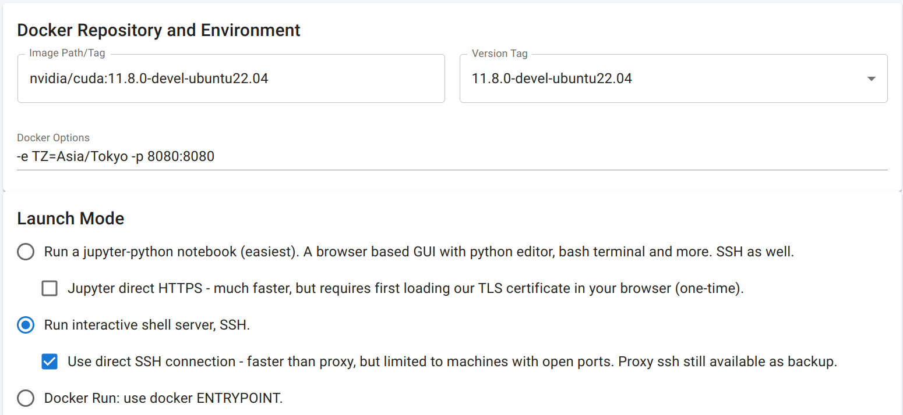
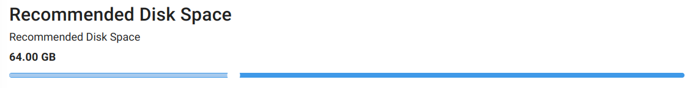

# ZOZO's Contact Solver 🫶 

A contact solver for physics-based simulations involving 👚 shells, 🪵 solids and 🪢 rods. All made by ZOZO.
Published in [ACM Transactions on Graphics (TOG)](https://dl.acm.org/doi/abs/10.1145/3687908).


  
## ✨ Highlights

- **💪 Robust**: Contact resolutions are penetration-free. No snagging intersections.
- **⏲ Scalable**: An extreme case includes beyond 150M contacts. Not just one million.
- **🚲 Cache Efficient**: All on the GPU runs in single precision. No double precision.
- **🥼 Inextensible**: Cloth never extends beyond very strict upper bounds, such as 1%.
- **📐 Physically Accurate**: Our deformable solver is driven by the Finite Element Method.
- **🚀 Massively Parallel**: Both contact and elasticity solvers are run on the GPU.
- **🐳 Docker Sealed**: Everything is designed to work out of the box.
- **🌐 JupyterLab Included**: Open your browser and run examples right away.
- **👌 Open**: We have opted the Apache v2.0 license.

## 🎓 Technical Materials

- 🎥 Main video [[Video]](https://drive.google.com/file/d/1OzPbUoqddUYDvXMvRnUHH7kz0nZhmt7K/view?usp=drive_link)
- 🎥 Additional video examples [[Directory]](https://drive.google.com/drive/folders/1O4t3CBcG8qqju_qun0RP60OULK4_1tTf?usp=drive_link)
- 📃 Main paper [[PDF]](https://drive.google.com/file/d/1OrOKJH_im1L4j1cJB18sfvNHEbZVSqjL/view?usp=drive_link)[[Hindsight]](./articles/hindsight.md)
- 📊 Supplementary PDF [[PDF]](https://drive.google.com/file/d/1ptjFNVufPBV4-vb5UDh1yTgz8-esjaSF/view?usp=drive_link)
- 🤖 Supplementary scripts [[Directory]](https://drive.google.com/drive/folders/13CO068xLkd6ZSxsqtJQdNadgMrbbfSug?usp=drive_link)
- 🔍 Singular-value eigenanalysis [[Markdown]](./articles/eigensys.md)

## ⚡️ Requirements

- 🔥 A modern NVIDIA GPU (Turing or newer).
- 🐳 A Docker environment (see [below](#-getting-started)).

## 🐍 How To Use
Our frontend is accessible through a browser using our built-in JupyterLab interface.
All is set up when you open it for the first time.
Results can be interactively viewed through the browser and exported as needed.
This allows you to interact with the simulator on your laptop while the actual simulation runs on a remote headless server.
Here's an example of draping five sheets over a sphere with two corners pinned.
Please look into the [examples](./examples/) directory for more examples.

```python
# import our frontend
from frontend import App

# make an app with the label "drape"
app = App("drape").clear()

# create a square mesh resolution 128
V, F = app.mesh.square(res=128)

# add to the asset and name it "sheet"
app.asset.add.tri("sheet", V, F)

# create an icosphere mesh radius 0.5 and 5 subdivisions
V, F = app.mesh.icosphere(r=0.5, subdiv_count=5)

# add to the asset and name it "sphere"
app.asset.add.tri("sphere", V, F)

# create a scene "five-sheets"
scene = app.scene.create("five-sheets")

# define gap between sheets
gap = 0.01

for i in range(5):
    
    # add a sheet to the scene
    obj = scene.add("sheet")

    # pick two vertices max towards directions [1,-1,0] and [-1,-1,0]
    corner = obj.grab([1, -1, 0]) + obj.grab([-1, -1, 0])

    # place it with a vertical offset, rotate it and pin the corners
    obj.at(0, gap * i, 0).rotate(90, "x").pin(corner)

    # set fiber directions required for the Baraff-Witkin model
    obj.direction([1, 0, 0], [0, 0, 1])

# add a sphere mesh at a lower position and set it to a static collider
scene.add("sphere").at(0, -0.5 - gap, 0).pin()

# compile the scene and report stats
fixed = scene.build().report()

# interactively preview the built scene (image left)
fixed.preview()

# set simulation parameter(s)
param = app.session.param()
param.set("dt", 0.01)

# create a new session with a name
session = app.session.create("dt-001").init(fixed)

# start the simulation and live-preview the results (image right)
session.start(param).preview()

# also show streaming logs
session.stream()

# or interactively view the animation sequences
session.animate()

# save the results (run this separately in a new cell)
session.export("five-sheets.ply") 
```

  
## 🖼️ Catalogue

|||||
|---|---|---|---|
|woven|stack|trampoline|needle|
|||||
|cards|codim|hang|trapped|
|||||
|domino|noodle|drape|quintuple|
|||||
|ribbon|curtain|fishingknot|friction|
|||||

At the moment, not all examples are ready yet, but they will be added/updated one by one.
The author is actively woriking on it.

## 💨 Getting Started

It can be stressful 😰 to build something that heavily depends on the GPU, but we've made things easy for you with clear instructions 👍.
First, we assume a Linux/bash/zsh environment, but this could also work for Windows with minor 🔧 tweaks (we don't own Windows).
To get the ball ⚽ rolling, we'll configure a Docker environment 🐳 to minimize any trouble 🤯 that 🥊 hits you.
Rest assured 😌, all the steps below are verified to run without errors via automated GitHub Actions (see `.github/workflows/getting-started.yml`).

> [!NOTE]
> If you wish to install our solver on a headless remote machine, SSH into the server with port forwarding using the following command:
> ```
> ssh -L 8080:localhost:8080 user@remote_server_address
> ```
> This port will be used to access the frontend afterward.
> The two port numbers of `8080` must match the value we set for `$MY_WEB_PORT` below.

First, please get a latest Docker environent 🐋 installed on your system [[Link]](https://docs.docker.com/engine/install/) and also install NVIDIA Container Toolkit [[Link]](https://docs.nvidia.com/datacenter/cloud-native/container-toolkit/latest/install-guide.html).
Of course, a CUDA toolkit, along with a driver, must also be installed on your host.
Next, create a container 📦 by the following Docker command:

```
MY_WEB_PORT=8080  # Port number for JupyterLab web browsing
MY_TIME_ZONE=Asia/Tokyo  # Your time zone
MY_CONTAINER_NAME=ppf-contact-solver  # Container name

docker run -it \
    --gpus all \
    -p $MY_WEB_PORT:8080 \
    -e TERM -e TZ=$MY_TIME_ZONE \
    -e LANG=en_US.UTF-8 \
    --hostname ppf-dev \
    --name $MY_CONTAINER_NAME -e \
    NVIDIA_DRIVER_CAPABILITIES=graphics,compute,utility \
    nvidia/cuda:11.8.0-devel-ubuntu22.04
```

At the end of the line you see:

```
root@ppf-dev:/#
```

From here on, all commands will happen in the 📦 container, not on your host.
Next, we'll make sure that a NVIDIA driver is visible from the Docker container. Try this

```
nvidia-smi
```

If successful, this will get back to you with something like this

```
+-----------------------------------------------------------------------------+
| NVIDIA-SMI 525.105.17   Driver Version: 525.105.17   CUDA Version: 12.0     |
|-------------------------------+----------------------+----------------------+
| GPU  Name        Persistence-M| Bus-Id        Disp.A | Volatile Uncorr. ECC |
| Fan  Temp  Perf  Pwr:Usage/Cap|         Memory-Usage | GPU-Util  Compute M. |
|                               |                      |               MIG M. |
|===============================+======================+======================|
|   0  NVIDIA GeForce ...  On   | 00000000:C1:00.0 Off |                  Off |
| 64%   51C    P2   188W / 450W |   4899MiB / 24564MiB |     91%      Default |
|                               |                      |                  N/A |
+-------------------------------+----------------------+----------------------+
                                                                               
+-----------------------------------------------------------------------------+
| Processes:                                                                  |
|  GPU   GI   CI        PID   Type   Process name                  GPU Memory |
|        ID   ID                                                   Usage      |
|=============================================================================|
+-----------------------------------------------------------------------------+

```

> [!NOTE]
> If an error occurs 🥵, make sure that `nvidia-smi` works on your host. If it does, verify that the NVIDIA Container Toolkit is properly installed. If it still doesn't work, running `sudo service docker restart` on your host may resolve the issue.

Please confirm that your GPU is properly detected and listed here.
Next, we'll make sure that your GPU has sufficient compute capabilities.
This can be confirmed by running

```
nvidia-smi --query-gpu=compute_cap --format=csv,noheader,nounits
```

and if this returns a number `7.5` or higher, your GPU satisfies the requirements to run our solver.
Next, we'll check if `nvcc` is properly installed and verify that its version is `11.8`.
This can be checked by running

```
nvcc --version | grep cuda_11.8
```

and it should get back to you with

```
Build cuda_11.8.r11.8/compiler.31833905_0
```

Now let's get the installation started.
No worries 🤙; all the commands below only disturb things in the container, so your host environment stays clean ✨.
First, install following packages

```
apt update
apt install -y curl git python3 python3-pip
pip3 install psutil click
```

Next, clone our respository

```
git clone https://github.com/st-tech/ppf-contact-solver.git
```

Move into the ```ppf-contact-solver``` and let ```warmup.py``` do all the rest 💤:

```
cd ppf-contact-solver
python3 warmup.py
```

> [!NOTE]
> If you’re suspicious, you can look around ```warmup.py``` before you proceed.

Now we're set. Let's kick in the compilation!🏃

```
source "$HOME/.cargo/env"
cargo build --release
```

Be patient; this takes some time... ⏰⏰ If the last line says 

```
Finished `release` profile [optimized] target(s) in ...
```

We're done! 🎉 Start our frontend by

```
python3 warmup.py jupyter
```

and now you can access our JupyterLab frontend from http://localhost:8080 on your 🌐 browser.
The port number `8080` is the one we set for `$MY_WEB_PORT`.
Enjoy! 😄

## 🧹 Cleaning Up

To remove all the files simply stop 🛑 the container and ❌ delete it.
Be aware that all simulation data will be also lost. Back up any important data if needed.

```
docker stop $MY_CONTAINER_NAME
docker rm $MY_CONTAINER_NAME
```

> [!NOTE]
> If you wish to completely wipe what we’ve done here, you may also need to purge the Docker image by:
> ```
> docker rmi $(docker images | grep 'nvidia/cuda' | grep '11.8.0-devel-ubuntu22.04' | awk '{print $3}')
> ```
> but don't do this if you still need it.

## ☁ Running on [vast.ai](https://vast.ai)

The exact same steps above should work, except that you'll need to create a Docker template. Here's one:

- **Image Path/Tag**: ```nvidia/cuda:11.8.0-devel-ubuntu22.04```
- **Docker Options**: ```-e TZ=Asia/Tokyo -p 8080:8080``` (Your time zone, of course)
- Make sure to select ✅ ***Run interactive shell server, SSH.***



- Also, make sure to allocate a large disk space, such as 64GB.



## 📃 License

📝 This project is licensed under Apache v2.0 license.

## 🙏 Acknowledgements

The author would like to thank ZOZO, Inc. for allowing him to work on this topic as part of his main workload.
The author also extends thanks to the teams in the IP department for permitting the publication of our technical work and the release of our code, as well as to many others for assisting with the internal paperwork required for publication.

## 🖋 Citation

```
@article{Ando2024CB,
author = {Ando, Ryoichi},
title = {A Cubic Barrier with Elasticity-Inclusive Dynamic Stiffness},
year = {2024},
issue_date = {December 2024},
publisher = {Association for Computing Machinery},
address = {New York, NY, USA},
volume = {43},
number = {6},
issn = {0730-0301},
url = {https://doi.org/10.1145/3687908},
doi = {10.1145/3687908},
journal = {ACM Trans. Graph.},
month = nov,
articleno = {224},
numpages = {13},
keywords = {collision, contact}
}
```

It should be emphasized that this work was strongly inspired by the IPC.
The author kindly encourages citing their [original work](https://dl.acm.org/doi/10.1145/3386569.3392425) as well.
