# ZOZO's Contact Solver 🫶

A contact solver for physics-based simulations involving 👚 shells, 🪵 solids and 🪢 rods. All made by ZOZO.
Published in [ACM Transactions on Graphics (TOG)](https://dl.acm.org/doi/abs/10.1145/3687908).

[](https://github.com/st-tech/ppf-contact-solver/actions/workflows/getting-started.yml) [](https://github.com/st-tech/ppf-contact-solver/actions/workflows/vast-all.yml) [](https://github.com/st-tech/ppf-contact-solver/actions/workflows/make-docs.yml)
[](https://github.com/st-tech/ppf-contact-solver/actions/workflows/build-docker.yml)


  
## ✨ Highlights

- **💪 Robust**: Contact resolutions are penetration-free. No snagging intersections.
- **⏲ Scalable**: An extreme case includes beyond 150M contacts. Not just one million.
- **🚲 Cache Efficient**: All on the GPU runs in single precision. No double precision.
- **🥼 Inextensible**: Cloth never extends beyond very strict upper bounds, such as 1%.
- **📐 Physically Accurate**: Our deformable solver is driven by the Finite Element Method.
- **⚔️ Highly Stressed**: We run GitHub Actions to run stress tests [10 times in a row](#️-ten-consecutive-runs).
- **🚀 Massively Parallel**: Both contact and elasticity solvers are run on the GPU.
- **🐳 Docker Sealed**: Everything is designed to work out of the box.
- **🌐 JupyterLab Included**: Open your browser and run examples right away [[Video]](https://drive.google.com/file/d/1n068Ai_hlfgapf2xkAutOHo3PkLpJXA4/view).
- **🐍 Documtened Python APIs**: Our Python code is fully [docstringed](https://st-tech.github.io/ppf-contact-solver/frontend.html) and lintable [[Video]](https://drive.google.com/file/d/1vCM7kNgXdqQRBjVaoEb6KwIdRR21V7sV/view).
- **☁️ Cloud-Ready**: Our solver can be seamlessly deployed on major cloud platforms.
- **✨ Stay Clean**: You can remove all traces after use.

## 🔖 Table of Contents

- [📝 Change History](#-change-history)
- [🎓 Technical Materials](#-technical-materials)
- [⚡️ Requirements](#️-requirements)
- [💨 Getting Started](#-getting-started)
- [🐍 How To Use](#-how-to-use)
- [📚 Python APIs and Parameters](#-python-apis-and-parameters)
- [🔍 Obtaining Logs](#-obtaining-logs)
- [🖼️ Catalogue](#️-catalogue)
- [🚀 GitHub Actions](#-github-actions)
    - [⚔️ Ten Consecutive Runs](#️-ten-consecutive-runs)
- [📡 Deploying on Cloud Services](#-deploying-on-cloud-services)
    - [📦 Deploying on vast.ai](#-deploying-on-vastai)
    - [📦 Deploying on RunPod](#-deploying-on-runpod)
    - [📦 Deploying on Scaleway](#-deploying-on-scaleway)
    - [📦 Deploying on Amazon Web Services](#-deploying-on-amazon-web-services)
    - [📦 Deploying on Google Compute Engine](#-deploying-on-google-compute-engine)
- [🙏 Acknowledgements](#-acknowledgements)
- [🖋 Citation](#-citation)

### 📚 Advanced Contents

- 🧑‍💻 Setting Up Your Development Environment [[Markdown]](./articles/develop.md#-setting-up-your-development-environment)
- 🐞 Bug Fixes and Updates [[Markdown]](./articles/bug.md)

## 📝 Change History

- (2025.1.8) Added a [domino example](./examples/domino.ipynb) [[Video]](https://drive.google.com/file/d/1N9y8eZrjSQhAUhKwiO9w8jW_T18zPnYf/view).
- (2025.1.5) Added a [single twist example](./examples/twist.ipynb) [[Video]](https://drive.google.com/file/d/1LDFKS-iBvl2uDdPVKaazQL25tYGEEyXr/view).
- (2024.12.31) Added full documentation for Python APIs, parameters, and log files [[GitHub Pages]](https://st-tech.github.io/ppf-contact-solver).
- (2024.12.27) Line search for strain limiting is improved [[Markdown]](./articles/bug.md#new-strain-limiting-line-search)
- (2024.12.23) Added [[Bug Fixes and Updates]](./articles/bug.md)
- (2024.12.21) Added a [house of cards example](./examples/cards.ipynb) [[Video]](https://drive.google.com/file/d/1PMdDnlyCsjinbvICKph_0UcXUfUvvUmZ/view)
- (2024.12.18) Added a [frictional contact example](./examples/friction.ipynb): armadillo sliding on the slope [[Video]](https://drive.google.com/file/d/12WGdfDTFIwCT0UFGEZzfmQreM6WSSHet/view)
- (2024.12.18) Added a [hindsight](./articles/hindsight.md) noting that the tilt angle was not $30^\circ$, but rather $26.57^\circ$
- (2024.12.16) Removed thrust dependencies to fix runtime errors for the driver version `560.94` [[Issue Link]](https://github.com/st-tech/ppf-contact-solver/issues/1)


## 🎓 Technical Materials

- 🎥 Main video [[Video]](https://drive.google.com/file/d/1OzPbUoqddUYDvXMvRnUHH7kz0nZhmt7K/view?usp=drive_link)
- 🎥 Additional video examples [[Directory]](https://drive.google.com/drive/folders/1O4t3CBcG8qqju_qun0RP60OULK4_1tTf?usp=drive_link)
- 🎥 Presentation videos [[Short]](https://drive.google.com/file/d/1axAbFRtbOxhkU7K3Wf9F5gh2iDNJn6CZ/view)[[Long]](https://drive.google.com/file/d/1zybHydN0a0cZ-ifl_D_LYLwdMOnz2YnP/view)
- 📃 Main paper [[PDF]](https://drive.google.com/file/d/1OrOKJH_im1L4j1cJB18sfvNHEbZVSqjL/view?usp=drive_link)[[Hindsight]](./articles/hindsight.md)
- 📊 Supplementary PDF [[PDF]](https://drive.google.com/file/d/1ptjFNVufPBV4-vb5UDh1yTgz8-esjaSF/view?usp=drive_link)
- 🤖 Supplementary scripts [[Directory]](https://drive.google.com/drive/folders/13CO068xLkd6ZSxsqtJQdNadgMrbbfSug?usp=drive_link)
- 🔍 Singular-value eigenanalysis [[Markdown]](./articles/eigensys.md)

## ⚡️ Requirements

- 🔥 A modern NVIDIA GPU (Turing or newer)
- 🐳 A Docker environment (see [below](#-getting-started))

## 💨 Getting Started

Install a 🎮 NVIDIA driver [[Link]](https://www.nvidia.com/en-us/drivers/) on your 💻 host system and follow the 📝 instructions below specific to the 🖥️ operating system to get a 🐳 Docker running:

🐧 Linux | 🪟 Windows
----|----
Install the Docker engine from here [[Link]](https://docs.docker.com/engine/install/). Also, install the NVIDIA Container Toolkit [[Link]](https://docs.nvidia.com/datacenter/cloud-native/container-toolkit/latest/install-guide.html). Just to make sure that the Container Toolkit is loaded, run `sudo service docker restart`. | Install the Docker Desktop [[Link]](https://docs.docker.com/desktop/setup/install/windows-install/). You may need to log out or reboot after the installation. After logging back in, launch Docker Desktop to ensure that Docker is running.

Next, run the following command to start the 📦 container:

#### 🪟 Windows (PowerShell)

```
$MY_WEB_PORT = 8080  # Web port number for web interface
$IMAGE_NAME = "ghcr.io/st-tech/ppf-contact-solver-compiled:latest"
docker run --rm --gpus all -p ${MY_WEB_PORT}:8080 $IMAGE_NAME
```

#### 🐧 Linux (Bash/Zsh)

```
MY_WEB_PORT=8080  # Web port number for web interface
IMAGE_NAME=ghcr.io/st-tech/ppf-contact-solver-compiled:latest
docker run --rm --gpus all -p ${MY_WEB_PORT}:8080 $IMAGE_NAME
```

⏳ Wait for a while until the container becomes a steady state.
Next, open your 🌐 browser and navigate to http://localhost:8080, where `8080` is the port number specified in the `MY_WEB_PORT` variable.
Keep your terminal window open.

🎉 Now you are ready to go! 🚀

### 🛑 Shutting Down

To shut down the container, just press `Ctrl+C` in the terminal.
The container will be removed and all traces will be 🧹 cleaned up.

### 🔧 Advanced Installation

If you wish to build the container from scratch 🛠️, please refer to the cleaner installation guide [[Markdown]](./articles/install.md) 📝.

## 🐍 How To Use

Our frontend is accessible through 🌐 a browser using our built-in JupyterLab 🐍 interface.
All is set up when you open it for the first time.
Results can be interactively viewed through the browser and exported as needed.

This allows you to interact with the simulator on your 💻 laptop while the actual simulation runs on a remote headless server over 🌍 the internet.
This means that you don't have to buy ⚙️ hardware, but can rent it at [vast.ai](https://vast.ai) or [RunPod](https://www.runpod.io/) for less than 💵 $1 per hour.
For example, this [[Video]](https://drive.google.com/file/d/1n068Ai_hlfgapf2xkAutOHo3PkLpJXA4/view) was recorded on a [vast.ai](https://vast.ai) instance.
The experience is 👍 good!

Our Python interface is designed with the following principles in mind:

- **🛠️ Dynamic Tri/Tet Creation**: Relying on non-integrated third-party tools for triangulation, tetrahedralization, and loading can make it difficult to dynamically adjust resolutions. Our built-in tri/tet creation tools eliminate this issue.

- **🚫 No Mesh Data**: Preparing mesh data using external tools can be cumbersome. Our frontend minimizes this effort by allowing meshes to be created on the fly or downloaded when needed.

- **🔗 Method Chaining**: We adopt the method chaining style from JavaScript, making the API intuitive and easy to understand.

- **📦 Single Import for Everything**: All frontend features are accessible by simply importing with `from frontend import App`.

Here's an example of draping five sheets over a sphere with two corners pinned.
Please look into the [examples](./examples/) directory for more examples.

```python
# import our frontend
from frontend import App

# make an app with the label "drape"
app = App("drape", renew=True)

# create a square mesh resolution 128 spanning the xz plane
V, F = app.mesh.square(res=128, ex=[1,0,0], ey=[0,0,1])

# add to the asset and name it "sheet"
app.asset.add.tri("sheet", V, F)

# create an icosphere mesh radius 0.5 and 5 subdivisions
V, F = app.mesh.icosphere(r=0.5, subdiv_count=5)

# add to the asset and name it "sphere"
app.asset.add.tri("sphere", V, F)

# create a scene "five-sheets"
scene = app.scene.create("five-sheets")

# define gap between sheets
gap = 0.01

for i in range(5):
    
    # add a sheet to the scene
    obj = scene.add("sheet")

    # pick two vertices max towards directions [1,0,-1] and [-1,0,-1]
    corner = obj.grab([1, 0, -1]) + obj.grab([-1, 0, -1])

    # place it with a vertical offset and pin the corners
    obj.at(0, gap * i, 0).pin(corner)

    # set fiber directions required for the Baraff-Witkin model
    obj.direction([1, 0, 0], [0, 0, 1])

# add a sphere mesh at a lower position and set it to a static collider
scene.add("sphere").at(0, -0.5 - gap, 0).pin()

# compile the scene and report stats
fixed = scene.build().report()

# interactively preview the built scene (image left)
fixed.preview()

# set simulation parameter(s)
param = app.session.param()
param.set("dt", 0.01)

# create a new session with the built scene
session = app.session.create(fixed)

# start the simulation and live-preview the results (image right)
session.start(param).preview()

# also show streaming logs
session.stream()

# or interactively view the animation sequences
session.animate()

# export all simulated frames and zip them
path = f"export/{scene.info.name}/{session.info.name}"
session.export.animation(path).zip()
```


## 📚 Python APIs and Parameters

- Full API documentation 📖 is available on our [GitHub Pages](https://st-tech.github.io/ppf-contact-solver/frontend.html). The major APIs are documented using docstrings ✍️ and compiled with [Sphinx](https://www.sphinx-doc.org/en/master/) ⚙️.
We have also included [`jupyter-lsp`](https://github.com/jupyter-lsp/jupyterlab-lsp) to provide interactive linting assistance 🛠️ and display docstrings as you type. See this video [[Video]](https://drive.google.com/file/d/1vCM7kNgXdqQRBjVaoEb6KwIdRR21V7sV/view) for an example.
The behaviors can be changed through the settings.

- A list of parameters used in `param.set(key,value)` is documented here [[GitHub Pages]](https://st-tech.github.io/ppf-contact-solver/parameters.html).

> [!NOTE]
> ⚠️ Please note that our Python APIs are subject to breaking changes as this repository undergoes frequent iterations. 🚧

## 🔍 Obtaining Logs

📊 Logs for the simulation can also be queried through the Python APIs 🐍. Here's an example of how to get a list of recorded logs 📝, fetch them 📥, and compute the average 🧮.

```python
# get a list of log names
logs = session.get.log.names()
assert 'time-per-frame' in logs
assert 'newton-steps' in logs

# get a list of time per video frame
msec_per_video = session.get.log.numbers('time-per-frame')

# compute the average time per video frame
print('avg per frame:', sum([n for _,n in msec_per_video])/len(msec_per_video))

# get a list of newton steps
newton_steps = session.get.log.numbers('newton-steps')

# compute the average of consumed newton steps
print('avg newton steps:', sum([n for _,n in newton_steps])/len(newton_steps))
```

Below are some representatives.
`vid_time` refers to the video time in seconds and is recorded as `float`.
`ms` refers to the consumed simulation time in milliseconds recorded as `int`.
`vid_frame` is the video frame count recorede as `int`.

| **Name** | **Description** | **Format**
|---------------|----------------|------------
| time-per-frame | Time per video frame | `list[(vid_frame,ms)]` |
| matrix-assembly | Matrix assembly time | `list[(vid_time,ms)]` |
| pcg-linsolve | Linear system solve time | `list[(vid_time,ms)]` |
| line-search | Line search time | `list[(vid_time,ms)]` |
| time-per-step | Time per step | `list[(vid_time,ms)]` |
| newton-steps | Newton iterations per step | `list[(vid_time,count)]` |
| num-contact | Contact count | `list[(vid_time,count)]` |
| max-sigma | Max stretch | `list(vid_time,float)` |

The full list of log names and their descriptions is documented here: [[GitHub Pages]](https://st-tech.github.io/ppf-contact-solver/logs.html).

Note that some entries have multiple records at the same video time ⏱️. This occurs because the same operation is executed multiple times 🔄 within a single step during the inner Newton's iterations 🧮. For example, the linear system solve is performed at each Newton's step, so if multiple Newton's steps are 🔁 executed, multiple linear system solve times appear in the record at the same 📊 video time.

If you would like to retrieve the raw log stream, you can do so by

```python
# Last 8 lines. Omit for everything.
for line in session.get.log.stream(n_lines=8):
    print(line)
```

This will output something like:

```
* dt: 1.000e-03
* max_sigma: 1.045e+00
* avg_sigma: 1.030e+00
------ newton step 1 ------
   ====== contact_matrix_assembly ======
   > dry_pass...0 msec
   > rebuild...7 msec
   > fillin_pass...0 msec
```

If you would like to read `stdout` and `stderr`, you can do so using `session.get.stdout()` and `session.get.stderr()` (if it exists). They return `list[str]`.

All the log files 📂 are available ✅ and can be fetched ⬇️ during the simulation 🧑‍💻.
  
## 🖼️ Catalogue

|||||
|---|---|---|---|
|woven|[stack](./examples/stack.ipynb) [[Video]](https://drive.google.com/file/d/1BAGtVaVJhAYWFFZStmKEBTA1u0bRnKro/view)|[trampoline](./examples/trampoline.ipynb) [[Video]](https://drive.google.com/file/d/1qrh29Y_mn77bfg7d4-d4oBtNU5bzoJbP/view)|[needle](./examples/needle.ipynb) [[Video]](https://drive.google.com/file/d/1DyyM3ER0liq63x24I2TJ7JVK3_2EJDc6/view)|
|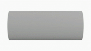|||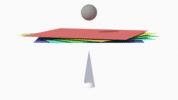|
|[cards](./examples/cards.ipynb) [[Video]](https://drive.google.com/file/d/1PMdDnlyCsjinbvICKph_0UcXUfUvvUmZ/view)|codim|[hang](./examples/hang.ipynb) [[Video]](https://drive.google.com/file/d/1gIjwaRrEifH0FQnZ8HO8Q9-f9FF5ZivG/view)|[trapped](./examples/trapped.ipynb)|
|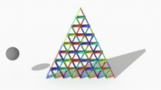|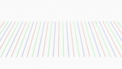|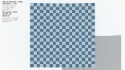||
|[domino](./examples/domino.ipynb) [[Video]](https://drive.google.com/file/d/1N9y8eZrjSQhAUhKwiO9w8jW_T18zPnYf/view)|noodle|[drape](./examples/drape.ipynb) [[Video]](https://drive.google.com/file/d/1PGL3tbA451VhHOViSJJNNdQvmUpg7bQd/view)|[twist](./examples/twist.ipynb) [[Video]](https://drive.google.com/file/d/1LDFKS-iBvl2uDdPVKaazQL25tYGEEyXr/view)|
|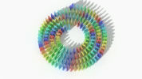|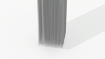|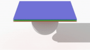|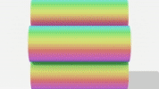|
|ribbon|[curtain](./examples/curtain.ipynb) [[Video]](https://drive.google.com/file/d/1c9W3YAFAS5r9m9i7sZHsFu8h98C8yy1T/view)|fishingknot|[friction](./examples/friction.ipynb) [[Video]](https://drive.google.com/file/d/12WGdfDTFIwCT0UFGEZzfmQreM6WSSHet/view)|
|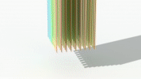|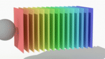|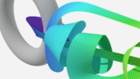|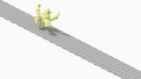|

At the moment, not all examples are ready yet, but they will be added/updated one by one.
The author is actively woriking on it.

## 🚀 GitHub Actions

We implemented GitHub Actions that test all of our examples.
We perform explicit intersection checks 🔍 at the end of each step, which raises an error ❌ if an intersection is detected.
This ensures that all steps are confirmed to be penetration-free if tests are pass ✅.
The runner types are described as follows:

### [](https://github.com/st-tech/ppf-contact-solver/actions/workflows/getting-started.yml)

The tested 🚀 runner of this action is the Ubuntu NVIDIA GPU-Optimized Image for AI and HPC with an NVIDIA Tesla T4 (16 GB VRAM) with Driver version 550.127.05.
This is not a self-hosted runner, meaning that each time the runner launches, all environments are 🌱 fresh.

### [](https://github.com/st-tech/ppf-contact-solver/actions/workflows/vast-all.yml)

We use the GitHub-hosted runner 🖥️, but the actual simulation runs on a provisioned [vast.ai](https://vast.ai) instance 🌐. We do this for performance ⚡ and budget 💰 reasons. We choose an RTX 4090 🎮, which typically costs less than $0.50 per hour 💵. Since we start with a fresh 🌱 instance, the environment is clean 🧹 every time.
We take advantage of the ability to deploy on the cloud; this action is performed in parallel, which reduces the total action time.

### ⚔️ Ten Consecutive Runs

We know that you can't judge the reliability of contact resolution by simply watching a success case in a single 🎥 video.
To ensure greater transparency, we implemented GitHub Actions to run many of our examples via automated GitHub Actions ⚙️, not just once, but 10 times in a row 🔁.
This means that **a single failure out of 10 tests is considered a failure of the entire test suite!**

[](https://github.com/st-tech/ppf-contact-solver/actions/workflows/example_drape.yml)
[](https://github.com/st-tech/ppf-contact-solver/actions/workflows/example_cards.yml)
[](https://github.com/st-tech/ppf-contact-solver/actions/workflows/example_curtain.yml)
[](https://github.com/st-tech/ppf-contact-solver/actions/workflows/example_friction.yml)
[](https://github.com/st-tech/ppf-contact-solver/actions/workflows/example_hang.yml)
[](https://github.com/st-tech/ppf-contact-solver/actions/workflows/example_needle.yml)
[](https://github.com/st-tech/ppf-contact-solver/actions/workflows/example_stack.yml)
[](https://github.com/st-tech/ppf-contact-solver/actions/workflows/example_trampoline.yml)
[](https://github.com/st-tech/ppf-contact-solver/actions/workflows/example_trapped.yml)
[](https://github.com/st-tech/ppf-contact-solver/actions/workflows/example_twist.yml)
[](https://github.com/st-tech/ppf-contact-solver/actions/workflows/example_domino.yml)

Also, we apply small jitters to the position of objects in the scene 🔄, so at each run, the scene is slightly different.

#### ⚠️ Disclaimer

Our long stress tests can fail due to following reasons:


- We are constantly updating our algorithms 🔄, which may introduce bugs. This stress test is indeed designed for this purpose 🎯.
- Failures can be also due to excessively difficult spots 🔬, which are unintended.
An example is shown in the right inset 👉.
- Occasionally, we experience [vast.ai](https://vast.ai) instances shutting down before simulations finish.

## 📡 Deploying on Cloud Services

Our contact solver is designed for heavy use in cloud services ☁️, enabling us to:

- **💰 Cost-Effective Development**: Quickly deploy testing environments 🚀 and delete 🗑️ them when not in use, saving costs.
- **📈 Flexible Scalability**: Scale as needed based on demand 📈. For example, you can launch multiple instances before a specific deadline ⏰.
- **🌍 High Accessibility**: Allow anyone with an internet connection 🌍 to try our solver, even on a smartphone 📱 or tablet 🖥️.
- **🐛 Easier Bug Tracking**: Users and developers can easily share the same hardware, kernel, and driver environment, making it easier to track and fix bugs.

This is all made possible with our purely web-based frontends 🌐 and scalable capability 🧩.
Our main target is the NVIDIA L4 🖱️, a data-center-targeted GPU 🖥️ that offers reasonable pricing 💲, delivering both practical performance 💪 and scalability 📊 without investing in expensive hardware 💻.

Below, we describe how to deploy our solver on major cloud services ☁️. These instructions are up to date as of late 2024 📅 and are subject to change 🔄.

**Important**: For all the services below, don't forget to ❌ delete the instance after use, or you’ll be 💸 charged for nothing.

### 📦 Deploying on [vast.ai](https://vast.ai)

- Select our template [[Link]](https://cloud.vast.ai/?creator_id=85288&name=ppf-contact-solver).
- Create an instance and click `Open` button.

### 📦 Deploying on [RunPod](https://runpod.io)

You can deploy our solver on a RunPod instance. To do this, we need to select an official RunPod Docker image instead.

- **Container Image**: `runpod/pytorch:2.0.1-py3.10-cuda11.8.0-devel-ubuntu22.04`
- **Expose HTTP Ports**: Empty
- **Expose TCP Ports**: `22`
- When connecting via SSH, make sure to include `-L 8080:localhost:8080` in the command.
- For a better experience, choose a geographically nearby server with a high connection speed.
- Also, make sure to allocate a large disk space, such as 64GB.
- ✅ Make sure to select `SSH Terminal Access`
- ❌ Deselect `Start Jupyter Notebook`
- Skip the Docker container creation in the installation process; it is already made.
- Follow the advanced installation [[Markdown]](./articles/install.md).
- CLI instructions are described in [[Markdown]](./articles/cloud.md#-runpod).

### 📦 Deploying on [Scaleway](https://www.scaleway.com/en/)

- Set zone to `fr-par-2`
- Select type `L4-1-24G` or `GPU-3070-S`
- Choose `Ubuntu Jammy GPU OS 12`
- *Do not skip* the Docker container creation in the installation process; it is required.
- This setup costs approximately €0.76 per hour.
- CLI instructions are described in [[Markdown]](./articles/cloud.md#-scaleway).

### 📦 Deploying on [Amazon Web Services](https://aws.amazon.com/en/)

- Amazon Machine Image (AMI): `Deep Learning Base OSS Nvidia Driver GPU AMI (Ubuntu 22.04)`
- Instance Type: `g6.2xlarge` (Recommended)
- This setup costs around $1 per hour.
- *Do not skip* the Docker container creation in the installation process; it is required.

### 📦 Deploying on [Google Compute Engine](https://cloud.google.com/products/compute)

- Select `GPUs`. We recommend the GPU type `NVIDIA L4` because it's affordable and accessible, as it does not require a high quota. You may select `T4` instead for testing purposes.
- Do **not** check `Enable Virtual Workstation (NVIDIA GRID)`.
- We recommend the machine type `g2-standard-8`.
- Choose the OS type `Deep Learning VM with CUDA 11.8 M126` and set the disk size to `50GB`.
- As of late 2024, this configuration costs approximately $0.86 per hour in `us-central1 (Iowa)` and $1.00 per hour in `asia-east1 (Taiwan)`. 
- Port number `8080` is reserved by the OS image. Set `$MY_WEB_PORT` to `8888`. When connecting via `gcloud`, use the following format:  `gcloud compute ssh --zone "xxxx" "instance-name" -- -L 8080:localhost:8888`.
- *Do not skip* the Docker container creation in the installation process; it is required.

- CLI instructions are described in [[Markdown]](./articles/cloud.md#-google-compute-engine).

## 🙏 Acknowledgements

The author would like to thank ZOZO, Inc. for allowing him to work on this topic as part of his main workload.
The author also extends thanks to the teams in the IP department for permitting the publication of our technical work and the release of our code, as well as to many others for assisting with the internal paperwork required for publication.

## 🖋 Citation

```
@article{Ando2024CB,
    author = {Ando, Ryoichi},
    title = {A Cubic Barrier with Elasticity-Inclusive Dynamic Stiffness},
    year = {2024},
    issue_date = {December 2024},
    publisher = {Association for Computing Machinery},
    address = {New York, NY, USA},
    volume = {43},
    number = {6},
    issn = {0730-0301},
    url = {https://doi.org/10.1145/3687908},
    doi = {10.1145/3687908},
    journal = {ACM Trans. Graph.},
    month = nov,
    articleno = {224},
    numpages = {13},
    keywords = {collision, contact}
}
```

It should be emphasized that this work was strongly inspired by the IPC.
The author kindly encourages citing their [original work](https://dl.acm.org/doi/10.1145/3386569.3392425) as well.
