# ZOZO's Contact Solver 🫶

A contact solver for physics-based simulations
involving 👚 shells, 🪵 solids and 🪢 rods. All made by [ZOZO, Inc.](https://corp.zozo.com/en/), the largest fashion e-commerce company in Japan.

[](https://github.com/st-tech/ppf-contact-solver/actions/workflows/getting-started.yml)
[](https://github.com/st-tech/ppf-contact-solver/actions/workflows/run-all-once.yml)
[](https://github.com/st-tech/ppf-contact-solver/actions/workflows/run-all-once-win.yml)
[](https://github.com/st-tech/ppf-contact-solver/actions/workflows/make-docs.yml)
[](https://github.com/st-tech/ppf-contact-solver/actions/workflows/build-docker.yml)
[](https://github.com/st-tech/ppf-contact-solver/actions/workflows/release-win.yml)
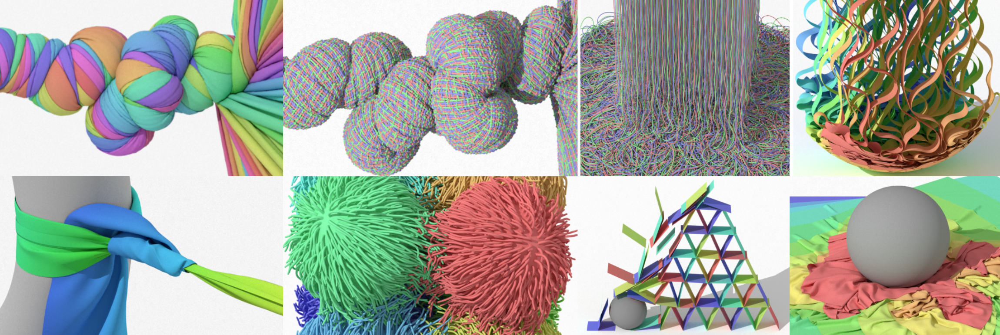

## 👀 Quick Look

🚀 Double click `start.bat` (Windows) or run a Docker command (Linux/Windows) to get it running


🌐 Click the URL and explore our examples

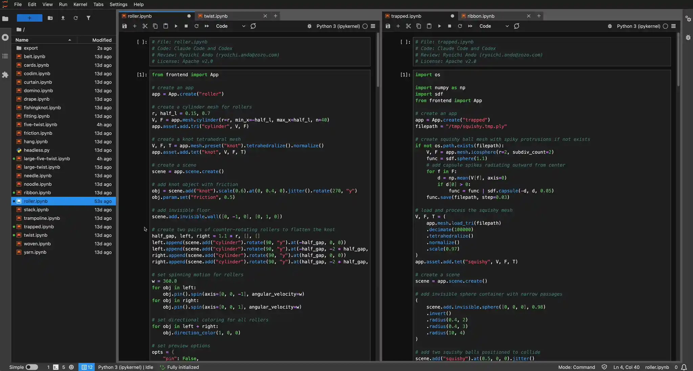

## ✨ Highlights

- **💪 Robust**: Contact resolutions are penetration-free. No snagging intersections.
- **⏲ Scalable**: An extreme case includes beyond 180M contacts. Not just one million.
- **🚲 Cache Efficient**: All on the GPU runs in single precision. No double precision.
- **🥼 Not Rubbery**: Triangles never extend beyond strict upper bounds (e.g., 1%).
- **📐 Finite Element Method**: We use FEM for deformables and symbolic force jacobians.
- **⚔️ Highly Stressed**: We run GitHub Actions to run stress tests [10 times in a row](#️-ten-consecutive-runs).
- **🚀 Massively Parallel**: Both contact and elasticity solvers are run on the GPU.
- **🪟 Windows Executable**: No installation wizard shown. Just unzip and run [(Video)](https://zozo.box.com/s/hkfxby26tycfsm7embpw1ld82urhitu7).
- **🐳 Docker Sealed**: All can be deployed fast. The image is ~1GB.
- **🌐 JupyterLab Included**: Open your browser and run examples right away [(Video)](https://zozo.box.com/s/4555t7c8v8uspyb4zhzbni5tn6wezra3).
- **🐍 Documented Python APIs**: Our Python code is fully [docstringed](https://st-tech.github.io/ppf-contact-solver/frontend.html) and lintable [(Video)](https://zozo.box.com/s/e7cfizbuaig9drpe01q5ospx8gez98ug).
- **☁️ Cloud-Ready**: Our solver can be seamlessly deployed on major cloud platforms.
- **✨ Stay Clean**: You can remove all traces after use.

> ⚠️ Built for offline uses; not real time. Some examples may run at an interactive rate.

## 🔖 Table of Contents

- [📝 Change History](#-change-history)
- [🎓 Technical Materials](#-technical-materials)
- [⚡️ Requirements](#️-requirements)
- [💨 Getting Started](#-getting-started)
  - [🪟 Windows Native Executable](#-windows-native-executable)
  - [🐳 Docker (Linux and Windows)](#-docker-linux-and-windows)
- [🐍 How To Use](#-how-to-use)
- [🧩 Community's Blender Add-ons](#-communitys-blender-add-ons)
- [📚 Python APIs and Parameters](#-python-apis-and-parameters)
- [🔍 Obtaining Logs](#-obtaining-logs)
- [🖼️ Catalogue](#️-catalogue)
  - [💰 Budget Table on AWS](#-budget-table-on-aws)
  - [🏗️ Large Scale Examples](#️-large-scale-examples)
- [🚀 GitHub Actions](#-github-actions)
  - [⚔️ Ten Consecutive Runs](#️-ten-consecutive-runs)
  - [📦 Action Artifacts](#-action-artifacts)
- [📡 Deploying on Cloud Services](#-deploying-on-cloud-services)
  - [📦 Deploying on vast.ai](#-deploying-on-vastai)
  - [📦 Deploying on RunPod](#-deploying-on-runpod)
  - [📦 Deploying on Scaleway](#-deploying-on-scaleway)
  - [📦 Deploying on Amazon Web Services](#-deploying-on-amazon-web-services)
  - [📦 Deploying on Google Compute Engine](#-deploying-on-google-compute-engine)
- [📬 Contributing](#-contributing)
- [👥 How We Built This](#-how-we-built-this)
- [🙏 Acknowledgements](#-acknowledgements)

### 📚 Advanced Contents

- 🧑 Setting Up Your Development Environment [(Markdown)](./articles/develop.md#-setting-up-your-development-environment)
- 🐞 Bug Fixes and Updates [(Markdown)](./articles/bug.md)

## 📝 Change History

- (2025.12.18) Added native Windows standalone executable build support [(Video)](https://zozo.box.com/s/hkfxby26tycfsm7embpw1ld82urhitu7).
- (2025.11.26) Added [large-woven.ipynb](./examples/large-woven.ipynb) [(Video)](https://zozo.box.com/s/m6ws08pueo30hbamu64flm1xo14la9x8) to [large scale examples](#️-large-scale-examples).
- (2025.11.12) Added [five-twist.ipynb](./examples/five-twist.ipynb) [(Video)](https://zozo.box.com/s/qi4uup7ngi1la7fo1dygnl9rtudpvo3b) and [large-five-twist.ipynb](./examples/large-five-twist.ipynb) [(Video)](https://zozo.box.com/s/8ua5r1cno9but33pid7z9jhzvfeydr27) showcasing over 180M count. See [large scale examples](#️-large-scale-examples).
- (2025.10.03) Massive refactor of the codebase [(Markdown)](./articles/refactor_202510.md). Note that this change includes breaking changes to our Python APIs.
- (2025.08.09) Added a hindsight note in [eigensystem analysis](./articles/eigensys.md) to acknowledge prior work by [Poya et al. (2023)](https://romeric.github.io/).
- (2025.05.01) Simulation states now can be saved and loaded [(Video)](https://zozo.box.com/s/ax8xtkqkir3fasrxjjoxuznj4vew69u3).

<details>
<summary>More history records</summary>
- (2025.04.02) Added 9 examples. See the [catalogue](#️-catalogue).
- (2025.03.03) Added a [budget table on AWS](#-budget-table-on-aws).
- (2025.02.28) Added a [reference branch and a Docker image of our TOG paper](#-technical-materials).
- (2025.02.26) Added Floating Point-Rounding Errors in ACCD in [hindsight](./articles/hindsight.md).
- (2025.02.07) Updated the [trapped example](./examples/trapped.ipynb) [(Video)](https://zozo.box.com/s/58au2sg70ojd02fy6cs4ly6s3cmywr10) with squishy balls.
- (2025.03.03) Added a [budget table on AWS](#-budget-table-on-aws).
- (2025.02.28) Added a [reference branch and a Docker image of our TOG paper](#-technical-materials).
- (2025.02.26) Added Floating Point-Rounding Errors in ACCD in [hindsight](./articles/hindsight.md).
- (2025.02.07) Updated the [trapped example](./examples/trapped.ipynb) [(Video)](https://zozo.box.com/s/58au2sg70ojd02fy6cs4ly6s3cmywr10) with squishy balls.
- (2025.1.8) Added a [domino example](./examples/domino.ipynb) [(Video)](https://zozo.box.com/s/w0fppdoli8heyuyi12n086vkax92lph3).
- (2025.1.5) Added a [single twist example](./examples/twist.ipynb) [(Video)](https://zozo.box.com/s/ekky63rp5i8bme1r4fjv4tlh558m5f6n).
- (2024.12.31) Added full documentation for Python APIs, parameters, and log files [(GitHub Pages)](https://st-tech.github.io/ppf-contact-solver).
- (2024.12.27) Line search for strain limiting is improved [(Markdown)](./articles/bug.md#new-strain-limiting-line-search)
- (2024.12.23) Added [(Bug Fixes and Updates)](./articles/bug.md)
- (2024.12.21) Added a [house of cards example](./examples/cards.ipynb) [(Video)](https://zozo.box.com/s/k2a6910gynnete3vfo5dgkhkwkaf96mj)
- (2024.12.18) Added a [frictional contact example](./examples/friction.ipynb): armadillo sliding on the slope [(Video)](https://zozo.box.com/s/vhhua1s3f93cihg97vp98kzk3wo924ot)
- (2024.12.18) Added a [hindsight](./articles/hindsight.md) noting that the tilt angle was not $30^\circ$, but rather $26.57^\circ$
- (2024.12.16) Removed thrust dependencies to fix runtime errors for the driver version `560.94` [(Issue Link)](https://github.com/st-tech/ppf-contact-solver/issues/1)
</details>

## 🎓 Technical Materials

#### 📘 **A Cubic Barrier with Elasticity-Inclusive Dynamic Stiffness**

- 📚 Published in [ACM Transactions on Graphics (TOG) Vol.43, No.6](https://dl.acm.org/doi/abs/10.1145/3687908)
- 🎥 Main video [(Video)](https://zozo.box.com/s/dpyum2shhlptzukd45jbqpdgl3f9zm51)
- 🎥 Additional video examples [(Directory)](https://zozo.box.com/s/l3lnj5wk42s1l9fk78dk5smc5n1bc563)
- 🎥 Presentation videos [(Short)](https://zozo.box.com/s/2ijudkl67tdntpxcrhfulxj6b0duomr0) [(Long)](<https://zozo.box.com/s/7efg1840osuvn7nczf1k2o48lt394jze>)
- 📃 Main paper [(PDF)](https://zozo.box.com/s/xnmpgsdul0o7jdk4yyjju00937653w7t) ([Hindsight)](./articles/hindsight.md)
- 📊 Supplementary PDF [(PDF)](https://zozo.box.com/s/ulc7i2jcz0bt9n27g5dfvk5ytvydkqw3)
- 🤖 Supplementary scripts [(Directory)](https://zozo.box.com/s/26cvgnyuaa6quof8cplkte775bxa5qnp)
- 🔍 Singular-value eigenanalysis [(Markdown)](./articles/eigensys.md)

##### 📌 Reference Implementation

The main branch is undergoing frequent updates and will deviate from the paper.
To retain consistency with the paper, we have created a new branch ```sigasia-2024```.

- 🛠️ Only maintenance updates are planned for this branch.
- 🚫 General users *should not* use this branch as it is not optimized for best performance.
- 🚫 All algorithmic changes listed in this [(Markdown)](./articles/bug.md) are excluded from this branch.
- 📦 We also provide a pre-compiled Docker image: ```ghcr.io/st-tech/ppf-contact-solver-compiled-sigasia-2024:latest``` of this branch.
- 🌐 [Template Link for vast.ai](https://cloud.vast.ai/?ref_id=85288&creator_id=85288&name=ppf-contact-solver-sigasia-2024)
- 🌐 [Template Link for RunPods](https://runpod.io/console/deploy?template=ooqpniuixi&ref=bhy3csxy)

## ⚡️ Requirements

- 🔥 A modern NVIDIA GPU (CUDA 12.8 or newer)
- 💻 x86 architecture (arm64 is not supported)
- 🐳 A Docker environment (see [below](#-docker-linux-and-windows)) or 🪟 Windows 10/11 for native executable (see [below](#-windows-native-executable))

## 💨 Getting Started

> ⚠️ Do not run `warmup.py` locally. If you do, you are very likely to hit failures and find it difficult to cleanup.

#### 🪟 Windows Native Executable

For Windows 10/11 users, a self-contained executable (~230MB) is available.
No Python, Docker, or CUDA Toolkit installation is needed.
All should simply work out of the box [(Video)](https://zozo.box.com/s/hkfxby26tycfsm7embpw1ld82urhitu7).

> 🤔 If you are cautious, you can review the [build workflow](https://github.com/st-tech/ppf-contact-solver/actions/workflows/release-win.yml) to verify safety yourself.
We try to maximize transparency; **we never build locally and upload.**

1. Install the latest NVIDIA driver [(Link)](https://www.nvidia.com/en-us/drivers/)
2. Download the latest release from [GitHub Releases](https://github.com/st-tech/ppf-contact-solver/releases) and unzip
3. Double click `start.bat`

JupyterLab frontend will auto-start. You should be able to access it at <http://localhost:8080>.

#### 🐳 Docker (Linux and Windows)

Install a NVIDIA driver [(Link)](https://www.nvidia.com/en-us/drivers/) on your host system and follow the instructions below specific to the operating system to get a Docker running:

🐧 Linux | 🪟 Windows
----|----
Install the Docker engine from here [(Link)](https://docs.docker.com/engine/install/). Also, install the NVIDIA Container Toolkit [(Link)](https://docs.nvidia.com/datacenter/cloud-native/container-toolkit/latest/install-guide.html). Just to make sure that the Container Toolkit is loaded, run `sudo service docker restart`. | Install the Docker Desktop [(Link)](https://docs.docker.com/desktop/setup/install/windows-install/). You may need to log out or reboot after the installation. After logging back in, launch Docker Desktop to ensure that Docker is running.

Next, run the following command to start the container. If no edits are needed, just copy and paste:

##### 🪟 Windows (PowerShell)

```bash
$MY_WEB_PORT = 8080  # Web port on your side
$IMAGE_NAME = "ghcr.io/st-tech/ppf-contact-solver-compiled:latest"
docker run --rm -it `
  --name ppf-contact-solver `
  --gpus all `
  -p ${MY_WEB_PORT}:${MY_WEB_PORT} `
  -e WEB_PORT=${MY_WEB_PORT} `
  $IMAGE_NAME # Image size ~1GB
```

##### 🐧 Linux (Bash/Zsh)

```bash
MY_WEB_PORT=8080  # Web port on your side
IMAGE_NAME=ghcr.io/st-tech/ppf-contact-solver-compiled:latest
docker run --rm -it \
  --name ppf-contact-solver \
  --gpus all \
  -p ${MY_WEB_PORT}:${MY_WEB_PORT} \
  -e WEB_PORT=${MY_WEB_PORT} \
  $IMAGE_NAME # Image size ~1GB
```

The image download shall be started.
Our image is hosted on [GitHub Container Registry](https://github.com/st-tech/ppf-contact-solver/pkgs/container/ppf-contact-solver-compiled) (~1GB).
JupyterLab will then auto-start.
Eventually you should be seeing:

```
==== JupyterLab Launched! 🚀 ====
     http://localhost:8080
    Press Ctrl+C to shutdown
================================
```

Next, open your browser and navigate to <http://localhost:8080>. The port `8080` can change if you change the `MY_WEB_PORT` variable.
Keep your terminal window open.
Now you are ready to go! 🎉

#### 🛑 Shutting Down

To shut down the container, just press `Ctrl+C` in the terminal.
The container will be removed and all traces will be cleaned up. 🧹

> If you wish to keep the container running in the background, replace `--rm` with `-d`. To shutdown the container and remove it, run `docker stop ppf-contact-solver && docker rm ppf-contact-solver`.

#### 🔧 Advanced Installation

If you wish to build the docker image from scratch, please refer to the cleaner installation guide [(Markdown)](./articles/install.md).

## 🐍 How To Use

Our frontend is accessible through a browser using our built-in JupyterLab interface.
All is set up when you open it for the first time. **No compilation is needed.**
Results can be interactively viewed through the browser and exported as needed.

This allows you to interact with the simulator on your laptop while the actual simulation runs on a remote headless server over the internet.
This means that **you don't have to own NVIDIA hardware**, but can rent it at [vast.ai](https://vast.ai) or [RunPod](https://www.runpod.io/) for less than $0.5 per hour.
Actually, this [(Video)](https://zozo.box.com/s/4555t7c8v8uspyb4zhzbni5tn6wezra3) was recorded on a [vast.ai](https://vast.ai) instance.
The experience is good! 👍

Our Python interface is designed with the following principles in mind:

- **🛠️ In-Pipeline Tri/Tet Creation**: Depending on external 3D/CAD softwares for triangulation or tetrahedralization makes dynamic resolution changes cumbersome. We provide handy `.triangulate()` and `.tetrahedralize()` calls to keep everything in-pipeline, allowing users to skip explicit mesh exports to 3D/CAD software.
- **🚫 No Mesh Data Included**: Preparing mesh data using external tools can be cumbersome. Our frontend minimizes this effort by allowing meshes to be created on the fly or downloaded when needed.
- **🔗 Method Chaining**: We adopt the method chaining style from JavaScript, making the API intuitive to understand and read smoothly.
- **📦 Single Import for Everything**: All frontend features are accessible by simply importing with `from frontend import App`.

Here's an example of draping five sheets over a sphere with two corners pinned.
We have more examples in the [examples](./examples/) directory. Please take a look! 👀

```python
# import our frontend
from frontend import App

# make an app
app = App.create("drape")

# create a square mesh resolution 128 spanning the xz plane
V, F = app.mesh.square(res=128, ex=[1, 0, 0], ey=[0, 0, 1])

# add to the asset and name it "sheet"
app.asset.add.tri("sheet", V, F)

# create an icosphere mesh radius 0.5
V, F = app.mesh.icosphere(r=0.5, subdiv_count=4)

# add to the asset and name it "sphere"
app.asset.add.tri("sphere", V, F)

# create a scene
scene = app.scene.create()

# define gap between sheets
gap = 0.01

for i in range(5):

    # add the sheet asset to the scene with an vertical offset
    obj = scene.add("sheet").at(0, gap * i, 0)

    # pick two corners
    corner = obj.grab([1, 0, -1]) + obj.grab([-1, 0, -1])

    # pin the corners
    obj.pin(corner)

    # set the strict limit on maximum strain to 5% per triangle
    obj.param.set("strain-limit", 0.05)

# add a sphere mesh at a lower position with jitter and set it static collider
scene.add("sphere").at(0, -0.5 - gap, 0).jitter().pin()

# compile the scene and report stats
scene = scene.build().report()

# preview the initial scene, shows image left
scene.preview()

# create a new session with the compiled scene
session = app.session.create(scene)

# set session params
session.param.set("frames", 100).set("dt", 0.01)

# build this session
session = session.build()

# start the simulation and live-preview the results, shows image right
session.start().preview()

# also show streaming logs
session.stream()

# or interactively view the animation sequences
session.animate()

# export all simulated frames in (sequences of ply meshes + a video)
session.export.animation()
```

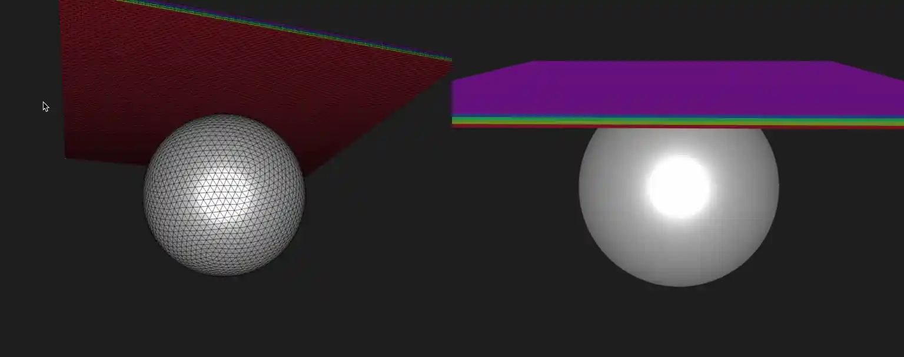

## 🧩 Community's Blender Add-ons

Official Blender add-ons are not yet ready, but we have community versions that you can try today:

- [AndoSim](https://github.com/Slaymish/AndoSim)
- [ArzteZ-PPF-solver](https://github.com/tavcitavci-sys-tavci-ui/ArzteZ-PPF-solver)

## 📚 Python APIs and Parameters

- Full API documentation is available on our [GitHub Pages](https://st-tech.github.io/ppf-contact-solver/frontend.html). The major APIs are documented using docstrings and compiled with [Sphinx](https://www.sphinx-doc.org/en/master/)
We have also included [`jupyter-lsp`](https://github.com/jupyter-lsp/jupyterlab-lsp) to provide interactive linting assistance and display docstrings as you type. See this video [(Video)](https://zozo.box.com/s/e7cfizbuaig9drpe01q5ospx8gez98ug) for an example.
The behaviors can be changed through the settings.

- A list of parameters used in `param.set(key,value)` is documented here: [(Global Parameters)](https://st-tech.github.io/ppf-contact-solver/global_parameters.html) [(Object Parameters)](https://st-tech.github.io/ppf-contact-solver/object_parameters.html).

> ⚠️ Please note that our Python APIs are subject to breaking changes as this repository undergoes frequent iterations. If you need APIs to be fixed, please fork.

## 🔍 Obtaining Logs

Logs for the simulation can also be queried through our Python APIs. Here's an example of how to get a list of recorded logs, fetch them, and compute the average.

```python
# get a list of log names
logs = session.get.log.names()
print(logs)
assert "time-per-frame" in logs
assert "newton-steps" in logs

# get a list of time per video frame
msec_per_video = session.get.log.numbers("time-per-frame")

# compute the average time per video frame
print("avg per frame:", sum([n for _, n in msec_per_video]) / len(msec_per_video))

# get a list of newton steps
newton_steps = session.get.log.numbers("newton-steps")

# compute the average of consumed newton steps
print("avg newton steps:", sum([n for _, n in newton_steps]) / len(newton_steps))

# Last 8 lines. Omit for everything.
print("==== log stream ====")
for line in session.get.log.stdout(n_lines=8):
    print(line)
```

Below are some representatives.
`vid_time` refers to the video time in seconds and is recorded as `float`.
`ms` refers to the consumed simulation time in milliseconds recorded as `int`.
`vid_frame` is the video frame count recorded as `int`.

| **Name** | **Description** | **Format**
|---------------|----------------|------------
| time-per-frame | Time per video frame | `list[(vid_frame,ms)]` |
| matrix-assembly | Matrix assembly time | `list[(vid_time,ms)]` |
| pcg-linsolve | Linear system solve time | `list[(vid_time,ms)]` |
| line-search | Line search time | `list[(vid_time,ms)]` |
| time-per-step | Time per step | `list[(vid_time,ms)]` |
| newton-steps | Newton iterations per step | `list[(vid_time,count)]` |
| num-contact | Contact count | `list[(vid_time,count)]` |
| max-sigma | Max stretch | `list(vid_time,float)` |

The full list of log names and their descriptions is documented here: [(GitHub Pages)](https://st-tech.github.io/ppf-contact-solver/logs.html).

Note that some entries have multiple records at the same video time. This occurs because the same operation is executed multiple times within a single step during the inner Newton's iterations. For example, the linear system solve is performed at each Newton's step, so if multiple Newton's steps are executed, multiple linear system solve times appear in the record at the same video time.

If you would like to retrieve the raw log stream, you can do so by

```python
# Last 8 lines. Omit for everything.
for line in session.get.log.stdout(n_lines=8):
    print(line)
```

This will output something like:

```text
* dt: 1.000e-03
* max_sigma: 1.045e+00
* avg_sigma: 1.030e+00
------ newton step 1 ------
   ====== contact_matrix_assembly ======
   > dry_pass...0 msec
   > rebuild...7 msec
   > fillin_pass...0 msec
```

If you would like to read `stderr`, you can do so using `session.get.stderr()` (if it exists).
This returns `list[str]`.
All the log files are updated in real-time and can be fetched right after the simulation starts; you don't have to wait until it finishes.

## 🖼️ Catalogue

|||||
|---|---|---|---|
|[woven.ipynb](./examples/woven.ipynb) [(Video)](https://zozo.box.com/s/run6g4opx6iknqtknkipohyj6bmnjxu7)|[stack.ipynb](./examples/stack.ipynb) [(Video)](https://zozo.box.com/s/81ecyyug64xbr7v6lj7z2r4m09sjk3nk)|[trampoline.ipynb](./examples/trampoline.ipynb) [(Video)](https://zozo.box.com/s/q19wsfjcp3ia82kqu3kp9mak29ljmbns)|[needle.ipynb](./examples/needle.ipynb) [(Video)](https://zozo.box.com/s/43bq01vgursul164coytdqx0yfk6jsva)|
||||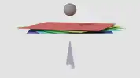|
|[cards.ipynb](./examples/cards.ipynb) [(Video)](https://zozo.box.com/s/k2a6910gynnete3vfo5dgkhkwkaf96mj)|[codim.ipynb](./examples/codim.ipynb) [(Video)](https://zozo.box.com/s/1rtit36y9yki9lmjrr0sxzhfirsv5myb)|[hang.ipynb](./examples/hang.ipynb) [(Video)](https://zozo.box.com/s/k9darcmdqj3lvneqk82cg91lx3nj8cb1)|[trapped.ipynb](./examples/trapped.ipynb) [(Video)](https://zozo.box.com/s/58au2sg70ojd02fy6cs4ly6s3cmywr10)|
|||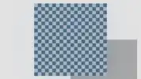||
|[domino.ipynb](./examples/domino.ipynb) [(Video)](https://zozo.box.com/s/w0fppdoli8heyuyi12n086vkax92lph3)|[noodle.ipynb](./examples/noodle.ipynb) [(Video)](https://zozo.box.com/s/catr9t4dlse0edaxhdewb6dbvjgc9t0w)|[drape.ipynb](./examples/drape.ipynb) [(Video)](https://zozo.box.com/s/gcuffxr1ntxm5uv8fqesoodxdr2ru3ls)|[five-twist.ipynb](./examples/five-twist.ipynb) [(Video)](https://zozo.box.com/s/qi4uup7ngi1la7fo1dygnl9rtudpvo3b)|
|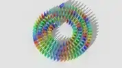||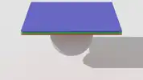||
|[ribbon.ipynb](./examples/ribbon.ipynb) [(Video)](https://zozo.box.com/s/b3otzpqtpmxdd8go7ih0m7xlzjbc7qkj)|[curtain.ipynb](./examples/curtain.ipynb) [(Video)](https://zozo.box.com/s/yqngh1dfyuup8r3to002tzld89e4jgz7)|[fishingknot.ipynb](./examples/fishingknot.ipynb) [(Video)](https://zozo.box.com/s/4x8nhru1mzxjk2z310kouc1vxv7kyszf)|[friction.ipynb](./examples/friction.ipynb) [(Video)](https://zozo.box.com/s/vhhua1s3f93cihg97vp98kzk3wo924ot)|
|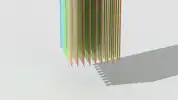|||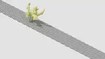|
|[belt.ipynb](./examples/belt.ipynb) [(Video)](https://zozo.box.com/s/0g6lo1n44eenk5619fxixia4z6ge08e6)|[fitting.ipynb](./examples/fitting.ipynb) [(Video)](https://zozo.box.com/s/6tscl116y05hic4dkk5ov4qb38bix8st)|[roller.ipynb](./examples/roller.ipynb) [(Video)](https://zozo.box.com/s/r0ea8135hljo8u50yug0tlgyst6vjgde)|[yarn.ipynb](./examples/yarn.ipynb) [(Video)](https://zozo.box.com/s/ig82ql72f8yc3pxbw44pveqjr2v514b7)|
||||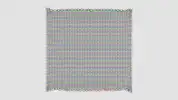|

### 💰 Budget Table on AWS

Below is a table summarizing the estimated costs for running our examples on a NVIDIA L4 instance `g6.2xlarge` at Amazon Web Services US regions (`us-east-1` and `us-east-2`).

- 💰 Uptime cost is approximately $1 per hour.
- ⏳ Deployment time is approximately 8 minutes ($0.13). Instance loading takes 3 minutes, and Docker pull & load takes 5 minutes.
- 🎮 The NVIDIA L4 delivers [30.3 TFLOPS for FP32](https://www.nvidia.com/en-us/data-center/l4/), offering approximately 36% of the [performance of an RTX 4090](https://www.nvidia.com/en-us/geforce/graphics-cards/40-series/rtx-4090/).
- 🎥 Video frame rate is 60fps.

| **Example** | **Cost** | **Time** | **#Frame** | **#Vert** | **#Face** | **#Tet** | **#Rod** | **Max Strain** |
|--------------|-------|-------|-----|--------|--------|--------|---------|-----|
| trapped      | $0.37 | 22.6m | 300 | 263K   | 299K   | 885K   | ```N/A```     | ```N/A``` |
| twist        | $0.91 | 55m   | 500 | 203K   | 406K   | ```N/A```    | ```N/A```     | ```N/A``` |
| stack        | $0.60 | 36.2m | 120 | 166.7K | 327.7K | 8.8K   | ```N/A```     | 5%  |
| trampoline   | $0.74 | 44.5m | 120 | 56.8K  | 62.2K  | 158.0K | ```N/A```     | 1%  |
| needle       | $0.31 | 18.4m | 120 | 86K    | 168.9K | 8.8K   | ```N/A```     | 5%  |
| cards        | $0.29 | 17.5m | 300 | 8.7K   | 13.8K  | 1.9K   | ```N/A```     | 5%  |
| domino       | $0.12 | 4.3m  | 250 | 0.5K   | 0.8K   | ```N/A```    | ```N/A```     | ```N/A``` |
| drape        | $0.10 | 3.5m  | 100 | 81.9K  | 161.3K | ```N/A```    | ```N/A```     | 5% |
| curtain      | $0.33 | 19.6m | 300 | 64K    | 124K   | ```N/A```    | ```N/A```     | 5% |
| friction     | $0.17 | 10m   | 700 | 1.1K   | ```N/A```    | 1K     | ```N/A```     | ```N/A``` |
| hang         | $0.12 | 7.5m  | 200 | 16.3K  | 32.2K  | ```N/A```    | ```N/A```     | 1%  |
| belt         | $0.19 | 11.4m | 200 | 12.3K  | 23.3K  | ```N/A```    | ```N/A```     | 5%  |
| codim        | $0.36 | 21.6m | 240 | 122.7K | 90K    | 474.1K | 1.3K    | ```N/A``` |
| fishingknot  | $0.38 | 22.5m | 830 | 19.6K  | 36.9K  | ```N/A```    | ```N/A```     | 5%  |
| fitting      | $0.03 | 1.54m | 240 | 28.4K  | 54.9K  | ```N/A```    | ```N/A```     | 10% |
| noodle       | $0.14 | 8.45m | 240 | 116.2K | ```N/A```    | ```N/A```    | 116.2K  | ```N/A``` |
| ribbon       | $0.23 | 13.9m | 480 | 34.9K  | 52.9K  | 8.8K   | ```N/A```     | 5%  |
| woven        | $0.58 | 34.6m | 450 | 115.6K | ```N/A```    | ```N/A```    | 115.4K  | ```N/A``` |
| yarn         | $0.01 | 0.24m | 120 | 28.5K  | ```N/A```    | ```N/A```    | 28.5K   | ```N/A``` |
| roller       | $0.03 | 2.08m | 240 | 21.4K  | 22.2K  | 61.0K  | ```N/A```     | ```N/A``` |

#### 🏗️ Large Scale Examples

Large scale examples are run on a [vast.ai](https://vast.ai) instance with an RTX 4090.
These examples are not included in GitHub Action tests since they can take days to finish.


| | | |
|---|---|---|
| [large-twist.ipynb](./examples/large-twist.ipynb) [(Video)](https://zozo.box.com/s/dy1rtvrk3c1499o29wobawu10jzfc1fu) | [large-five-twist.ipynb](./examples/large-five-twist.ipynb) [(Video)](https://zozo.box.com/s/8ua5r1cno9but33pid7z9jhzvfeydr27) | [large-woven.ipynb](./examples/large-woven.ipynb) [(Video)](https://zozo.box.com/s/m6ws08pueo30hbamu64flm1xo14la9x8) |
| 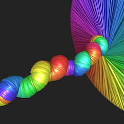 | 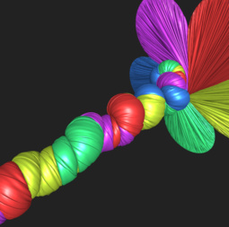 | 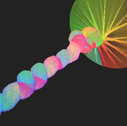 |

| Example | Commit | #Vert | #Face | #Rod | #Contact | #Frame | Time/Frame |
|---|---|---|---|---|---|---|---|
| large-twist | [cbafbd2](https://github.com/st-tech/ppf-contact-solver/tree/cbafbd2197fc7f28673386dfaf1e8d8a1be49937) | 3.2M | 6.4M | ```N/A``` | 56.7M | 2,000 | 46.4s |
| large-five-twist | [6ab6984](https://github.com/st-tech/ppf-contact-solver/commit/6ab6984d95f67673f1ebfdc996b0320123d88bed) | 8.2M | 16.4M | ```N/A``` | 184.1M | 2,413 | 144.5s |
| large-woven | [4c07b83](https://github.com/st-tech/ppf-contact-solver/commit/4c07b834b299e49bb08797940e9f0869789301b8) | 2.7M | ```N/A``` | 2.7M | 8.9M | 946 | 436.8s |


📝 Large scale examples take a very long time, and it's easy to lose connection or close the browser.
Our frontend lets you close and reopen it at your convenience. Just recover your session after you reconnect.
Here's an example cell how to recover:

```python
# In case you shutdown the server (or kernel) and still want
# to restart, do this.
# Do not run other cells used to create this scene.
# You can also recover this way if you closed the browser.
# Just directly run this in a new cell or in a new notebook.

from frontend import App

# recover the session
session = App.recover("app-name")

# resume if not currently running
if not App.busy():
    session.resume()

# preview the current state
session.preview()

# stream the logs
session.stream()
```


## 🚀 GitHub Actions

We implemented GitHub Actions that test all of our examples except for large scale ones, which take from days to weeks to finish.
We perform explicit intersection checks at the end of each step, which raises an error if an intersection is detected.
**This ensures that all steps are confirmed to be penetration-free if tests pass.**
The runner types are described as follows:

### [](https://github.com/st-tech/ppf-contact-solver/actions/workflows/getting-started.yml)

The tested runner of this action is the Ubuntu NVIDIA GPU-Optimized Image for AI and HPC with an NVIDIA Tesla T4 (16 GB VRAM) with Driver version ``570.133.20``.
This is not a self-hosted runner, meaning that each time the runner launches, all environments are fresh. 🌱

### [](https://github.com/st-tech/ppf-contact-solver/actions/workflows/run-all-once.yml) [](https://github.com/st-tech/ppf-contact-solver/actions/workflows/run-all-once-win.yml)

We use the GitHub-hosted runner, but the actual simulation runs on a `g6e.2xlarge` AWS instance.
Since we start with a fresh instance, the environment is clean every time.
We take advantage of the ability to deploy on the cloud; this action is performed in parallel, which reduces the total action time.

### 📦 Action Artifacts

We generate zipped action artifacts for each run. These artifacts include:

- **📝 Logs**: Detailed logs of the simulation runs.
- **📊 Metrics**: Performance metrics and statistics.
- **📹 Videos**: Simulated animations.

Please note that these artifacts will be deleted after a month.

### ⚔️ Ten Consecutive Runs

We know that you can't judge the reliability of contact resolution by simply watching a single success video example.
To ensure greater transparency, we implemented GitHub Actions to run many of our examples via automated GitHub Actions, not just once, but **10 times in a row** for both Docker and Windows.
This means that **a single failure out of 10 tests is considered a failure of the entire test suite!**
Also, we apply small jitters to the position of objects in the scene, so **at each run, the scene is slightly different.**

##### 🪟 Windows Native

[](https://github.com/st-tech/ppf-contact-solver/actions/workflows/drape-win.yml)
[](https://github.com/st-tech/ppf-contact-solver/actions/workflows/cards-win.yml)
[](https://github.com/st-tech/ppf-contact-solver/actions/workflows/curtain-win.yml)
[](https://github.com/st-tech/ppf-contact-solver/actions/workflows/friction-win.yml)
[](https://github.com/st-tech/ppf-contact-solver/actions/workflows/hang-win.yml)
[](https://github.com/st-tech/ppf-contact-solver/actions/workflows/needle-win.yml)
[](https://github.com/st-tech/ppf-contact-solver/actions/workflows/stack-win.yml)
[](https://github.com/st-tech/ppf-contact-solver/actions/workflows/trampoline-win.yml)
[](https://github.com/st-tech/ppf-contact-solver/actions/workflows/trapped-win.yml)
[](https://github.com/st-tech/ppf-contact-solver/actions/workflows/twist-win.yml)
[](https://github.com/st-tech/ppf-contact-solver/actions/workflows/five-twist-win.yml)
[](https://github.com/st-tech/ppf-contact-solver/actions/workflows/domino-win.yml)
[](https://github.com/st-tech/ppf-contact-solver/actions/workflows/belt-win.yml)
[](https://github.com/st-tech/ppf-contact-solver/actions/workflows/codim-win.yml)
[](https://github.com/st-tech/ppf-contact-solver/actions/workflows/fishingknot-win.yml)
[](https://github.com/st-tech/ppf-contact-solver/actions/workflows/fitting-win.yml)
[](https://github.com/st-tech/ppf-contact-solver/actions/workflows/noodle-win.yml)
[](https://github.com/st-tech/ppf-contact-solver/actions/workflows/ribbon-win.yml)
[](https://github.com/st-tech/ppf-contact-solver/actions/workflows/woven-win.yml)
[](https://github.com/st-tech/ppf-contact-solver/actions/workflows/yarn-win.yml)
[](https://github.com/st-tech/ppf-contact-solver/actions/workflows/roller-win.yml)

##### 🐧 Linux

[](https://github.com/st-tech/ppf-contact-solver/actions/workflows/drape.yml)
[](https://github.com/st-tech/ppf-contact-solver/actions/workflows/cards.yml)
[](https://github.com/st-tech/ppf-contact-solver/actions/workflows/curtain.yml)
[](https://github.com/st-tech/ppf-contact-solver/actions/workflows/friction.yml)
[](https://github.com/st-tech/ppf-contact-solver/actions/workflows/hang.yml)
[](https://github.com/st-tech/ppf-contact-solver/actions/workflows/needle.yml)
[](https://github.com/st-tech/ppf-contact-solver/actions/workflows/stack.yml)
[](https://github.com/st-tech/ppf-contact-solver/actions/workflows/trampoline.yml)
[](https://github.com/st-tech/ppf-contact-solver/actions/workflows/trapped.yml)
[](https://github.com/st-tech/ppf-contact-solver/actions/workflows/twist.yml)
[](https://github.com/st-tech/ppf-contact-solver/actions/workflows/five-twist.yml)
[](https://github.com/st-tech/ppf-contact-solver/actions/workflows/domino.yml)
[](https://github.com/st-tech/ppf-contact-solver/actions/workflows/belt.yml)
[](https://github.com/st-tech/ppf-contact-solver/actions/workflows/codim.yml)
[](https://github.com/st-tech/ppf-contact-solver/actions/workflows/fishingknot.yml)
[](https://github.com/st-tech/ppf-contact-solver/actions/workflows/fitting.yml)
[](https://github.com/st-tech/ppf-contact-solver/actions/workflows/noodle.yml)
[](https://github.com/st-tech/ppf-contact-solver/actions/workflows/ribbon.yml)
[](https://github.com/st-tech/ppf-contact-solver/actions/workflows/woven.yml)
[](https://github.com/st-tech/ppf-contact-solver/actions/workflows/yarn.yml)
[](https://github.com/st-tech/ppf-contact-solver/actions/workflows/roller.yml)

## 📡 Deploying on Cloud Services

Our contact solver is designed for heavy use in cloud services, enabling:

- **💰 Cost-Effective Development**: Quickly deploy testing environments and delete them when not in use, saving costs.
- **📈 Flexible Scalability**: Scale as needed. For example, you can launch multiple instances for short-term spiky demands.
- **🤝 Work Together**: Share the JupyterLab link with remote collaborators to work together.
- **🔒 Strong Security**: Benefit from the security features provided by cloud providers.
- **🐛 Fast Bug Tracking**: Users and developers can easily share the same hardware, kernel, and driver environment, making it easier to reproduce and fix bugs.
- **🛠️ Zero Hardware Maintenance**: No need to maintain hardware or introduce redundancy for malfunctions.

Below, we describe how to deploy our solver on major cloud services. These instructions are up to date as of late 2024 and are subject to change.

> ⚠️ For all the services below, don't forget to delete the instance after use, or you'll be charged for nothing. 💸

### 📦 Deploying on [vast.ai](https://vast.ai)

- Select our template [(Link)](https://cloud.vast.ai/?creator_id=85288&name=ppf-contact-solver).
- Create an instance and click `Open` button.

> ⚠️ `Open` button URL is public (not secure); only for testing purposes and should not be used for production use. For better security, duplicate the template and close the port, then use SSH port forwarding instead.

### 📦 Deploying on [RunPod](https://runpod.io)

- Follow this link [(Link)](https://runpod.io/console/deploy?template=we8ta2hy86&ref=bhy3csxy) and deploy an instance using our template.
- Click `Connect` button and open the `HTTP Services` link.

> ⚠️ `HTTP Services` URL is public (not secure); only for testing purposes and should not be used for production use. For better security, duplicate the template and close the port, then use SSH port forwarding instead.

### 📦 Deploying on [Scaleway](https://www.scaleway.com/en/)

- Set zone to `fr-par-2`
- Select type `L4-1-24G` or `GPU-3070-S`
- Choose `Ubuntu Jammy GPU OS 12`
- *Do not skip* the Docker container creation in the installation process; it is required.
- This setup costs approximately €0.76 per hour.
- CLI instructions are described in [(Markdown)](./articles/cloud.md#-scaleway).

### 📦 Deploying on [Amazon Web Services](https://aws.amazon.com/en/)

- Amazon Machine Image (AMI): `Deep Learning Base AMI with Single CUDA (Ubuntu 22.04)`
- Instance Type: `g6.2xlarge` (Recommended)
- This setup costs around $1 per hour.
- *Do not skip* the Docker container creation in the installation process; it is required.

### 📦 Deploying on [Google Compute Engine](https://cloud.google.com/products/compute)

- Select `GPUs`. We recommend the GPU type `NVIDIA L4` because it's affordable and accessible, as it does not require a high quota. You may select `T4` instead for testing purposes.
- Do **not** check `Enable Virtual Workstation (NVIDIA GRID)`.
- We recommend the machine type `g2-standard-8`.
- Choose the OS type `Deep Learning VM with CUDA 12.4 M129` and set the disk size to `50GB`.
- As of late 2024, this configuration costs approximately $0.86 per hour in `us-central1 (Iowa)` and $1.00 per hour in `asia-east1 (Taiwan)`.
- Port number `8080` is reserved by the OS image. Set `$MY_WEB_PORT` to `8888`. When connecting via `gcloud`, use the following format:  `gcloud compute ssh --zone "xxxx" "instance-name" -- -L 8080:localhost:8888`.
- *Do not skip* the Docker container creation in the installation process; it is required.
- CLI instructions are described in [(Markdown)](./articles/cloud.md#-google-compute-engine).

## 📬 Contributing

We appreciate your interest in opening pull requests, but we are not ready to accept external contributions because doing so involves resolving copyright and licensing matters with [ZOZO, Inc.](https://corp.zozo.com/en/)
For the time being, please open issues for bug reports.
If you wish to extend the codebase, please fork the repository and work on it.
Thank you!

## 👥 How We Built This

A large portion of this codebase was written by the author with GitHub Copilot in the early stages, and nearly all subsequent coding has been carried out through vibe coding with Claude Code and Codex since they became available. All has been human-reviewed by the author before being made public.

## 🙏 Acknowledgements

The author thanks [ZOZO, Inc.](https://corp.zozo.com/en/) for permitting the release of the code and the team members for assisting with the internal paperwork for this project.
This repository is owned by [ZOZO, Inc.](https://corp.zozo.com/en/)
