# Fabric preset calibration report

How each bundled fabric preset behaves: how much it drapes, how much it droops under its own weight, and how easily it stretches. Each fabric is shown with simulated images and its parameters.

- **Drape**: a round fabric sheet hangs over a smaller disc. The drape coefficient is how much of its flat area the shadow still covers: a soft, drapey fabric collapses into deep folds and covers little (low %), while a stiff fabric stays spread out (high %). The values match published measurements for each fabric. The fold count is the number of waves around the rim (approximate).
- **Bending**: a 9 cm strip is held at one end and droops under gravity. The tip droop angle shows bending stiffness: a stiffer fabric droops less.
- **Stretch**: the young-mod and Poisson values describe how the fabric stretches in its plane. Silk and wool stretch more easily; denim and leather barely stretch.

## Summary

| Fabric | Drape DC % | Target % | Folds | Bend droop (deg) | bend | young-mod | Poisson |
| --- | ---: | ---: | ---: | ---: | ---: | ---: | ---: |
| Silk | 34.8 | 20-40 | 14 | 80.4 | 1.42 | 500 | 0.4 |
| Flag | 27.0 | 20-40 | 12 | 83.7 | 0.83 | 1000 | 0.4 |
| Cotton | 70.1 | 60-76 | 12 | 66.9 | 4.3 | 5500 | 0.35 |
| Wool | 61.7 | 40-70 | 10 | 69.6 | 3.67 | 2000 | 0.4 |
| Denim | 85.4 | 70-90 | 8 | 48.9 | 10.0 | 10000 | 0.25 |
| Leather | 67.1 | 47-70 | 16 | 78.0 | 1.8 | 13000 | 0.4 |

## Silk

Drape coefficient **34.8%** &nbsp;|&nbsp; observed folds **14** &nbsp;|&nbsp; cantilever tip droop **80.4 deg** &nbsp;|&nbsp; bend `1.42`, young-mod `500`, Poisson `0.4`

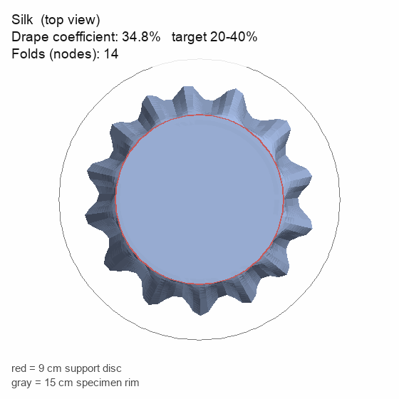

Looking straight down at the draped fabric. The shaded area is its shadow (the drape coefficient); the wavy edge is its folds.

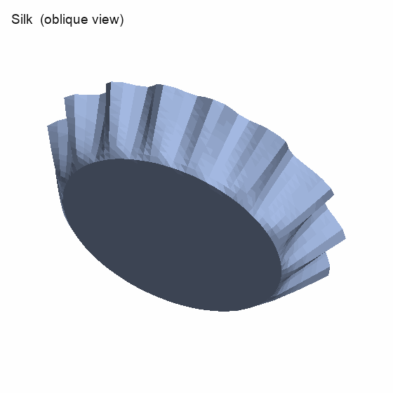

The same drape seen at an angle, showing the folds.

A strip held at the left, drooping under gravity. The blue line is its centerline; the angle it makes with horizontal (gray) is the droop.

## Flag

Drape coefficient **27.0%** &nbsp;|&nbsp; observed folds **12** &nbsp;|&nbsp; cantilever tip droop **83.7 deg** &nbsp;|&nbsp; bend `0.83`, young-mod `1000`, Poisson `0.4`

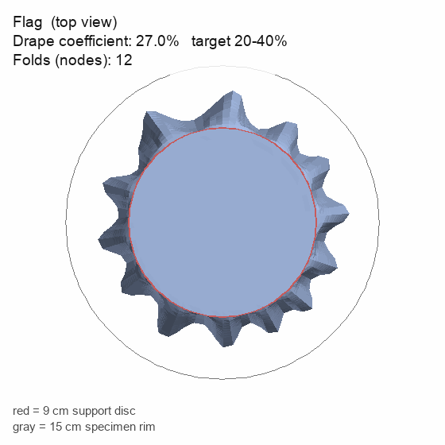

Looking straight down at the draped fabric. The shaded area is its shadow (the drape coefficient); the wavy edge is its folds.

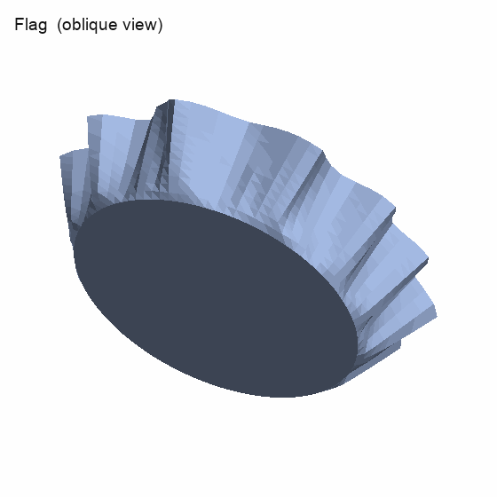

The same drape seen at an angle, showing the folds.

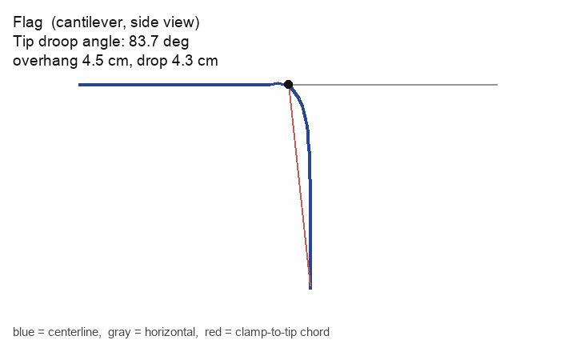

A strip held at the left, drooping under gravity. The blue line is its centerline; the angle it makes with horizontal (gray) is the droop.

## Cotton

Drape coefficient **70.1%** &nbsp;|&nbsp; observed folds **12** &nbsp;|&nbsp; cantilever tip droop **66.9 deg** &nbsp;|&nbsp; bend `4.3`, young-mod `5500`, Poisson `0.35`

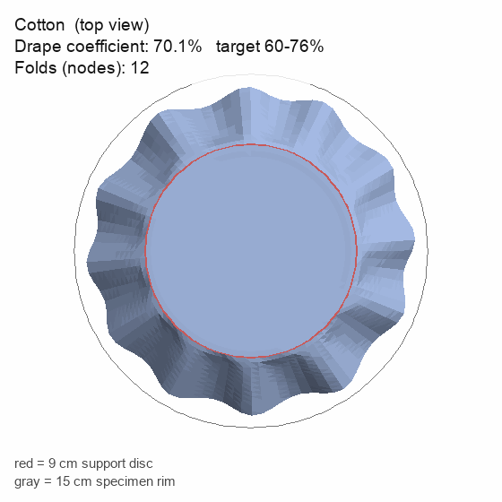

Looking straight down at the draped fabric. The shaded area is its shadow (the drape coefficient); the wavy edge is its folds.

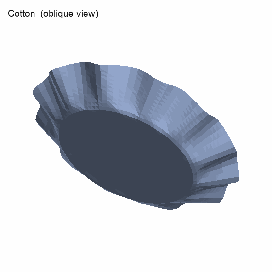

The same drape seen at an angle, showing the folds.

A strip held at the left, drooping under gravity. The blue line is its centerline; the angle it makes with horizontal (gray) is the droop.

## Wool

Drape coefficient **61.7%** &nbsp;|&nbsp; observed folds **10** &nbsp;|&nbsp; cantilever tip droop **69.6 deg** &nbsp;|&nbsp; bend `3.67`, young-mod `2000`, Poisson `0.4`

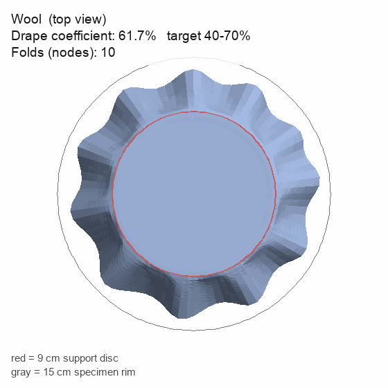

Looking straight down at the draped fabric. The shaded area is its shadow (the drape coefficient); the wavy edge is its folds.

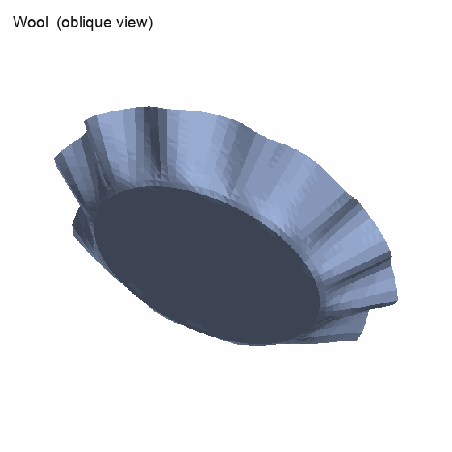

The same drape seen at an angle, showing the folds.

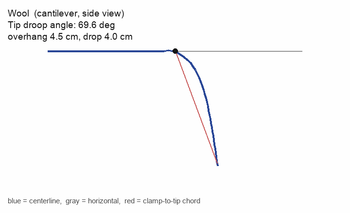

A strip held at the left, drooping under gravity. The blue line is its centerline; the angle it makes with horizontal (gray) is the droop.

## Denim

Drape coefficient **85.4%** &nbsp;|&nbsp; observed folds **8** &nbsp;|&nbsp; cantilever tip droop **48.9 deg** &nbsp;|&nbsp; bend `10.0`, young-mod `10000`, Poisson `0.25`

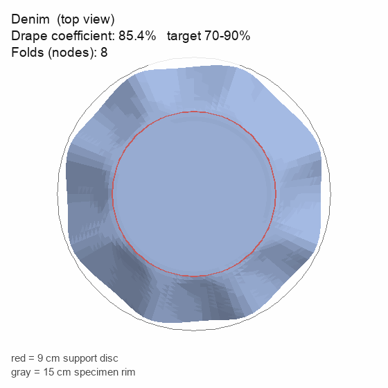

Looking straight down at the draped fabric. The shaded area is its shadow (the drape coefficient); the wavy edge is its folds.

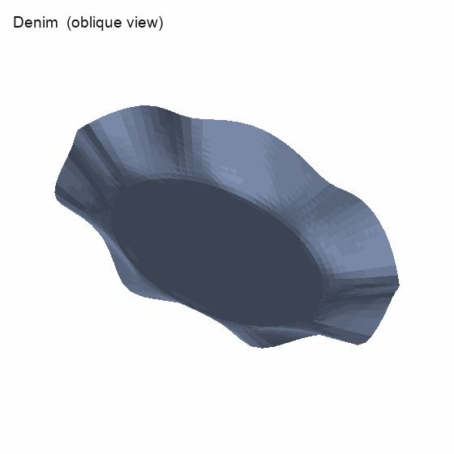

The same drape seen at an angle, showing the folds.

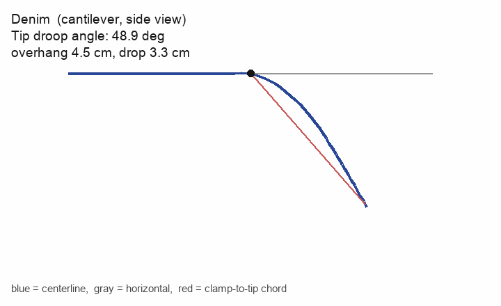

A strip held at the left, drooping under gravity. The blue line is its centerline; the angle it makes with horizontal (gray) is the droop.

## Leather

Drape coefficient **67.1%** &nbsp;|&nbsp; observed folds **16** &nbsp;|&nbsp; cantilever tip droop **78.0 deg** &nbsp;|&nbsp; bend `1.8`, young-mod `13000`, Poisson `0.4`

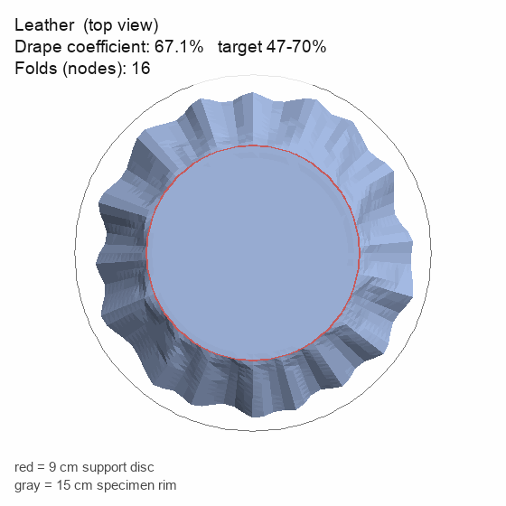

Looking straight down at the draped fabric. The shaded area is its shadow (the drape coefficient); the wavy edge is its folds.

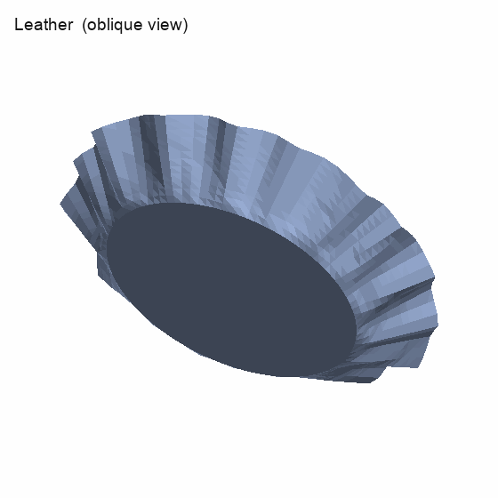

The same drape seen at an angle, showing the folds.

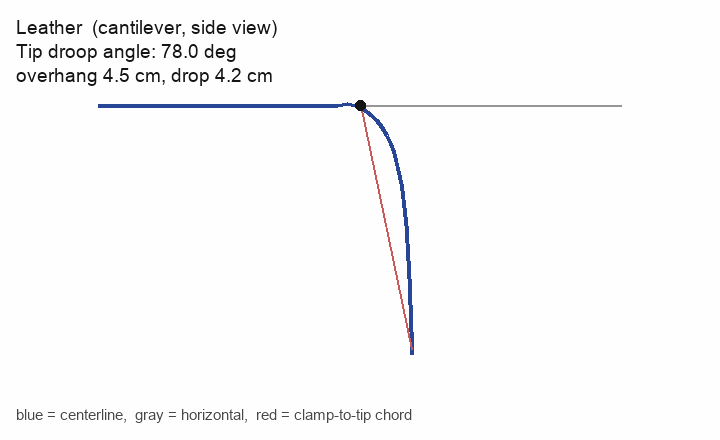

A strip held at the left, drooping under gravity. The blue line is its centerline; the angle it makes with horizontal (gray) is the droop.

---

Drape coefficients follow the Cusick method (BS 5058 / ISO 9073-9); cantilever bending follows ASTM D1388. Per-fabric reference values and citations are in the `calibration/` folder.
