# 🎬 Video Tutorials

<figure>
<figcaption><strong>Introduction</strong>A walkthrough of the add-on, from connecting to a server to running a first simulation.</figcaption>

[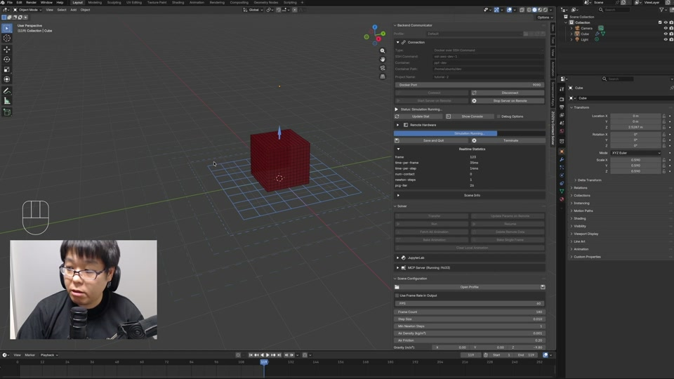](https://zozo.box.com/s/quj493d0fqi7tg20e3j6lubh6qw9temz){target="_blank" rel="noopener"}

</figure>
<figure>
<figcaption><strong>Windows Setup</strong>Install and configure the add-on on Windows.</figcaption>

[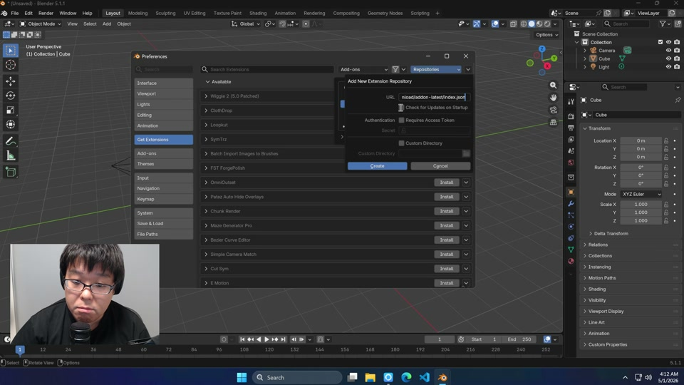](https://zozo.box.com/s/jhs75ddc3oihrl4bw4fa00hpi2dsjdrs){target="_blank" rel="noopener"}

</figure>
<figure>
<figcaption><strong>Fitting Cloth</strong>Drape cloth onto a target form so it conforms to the shape.</figcaption>

[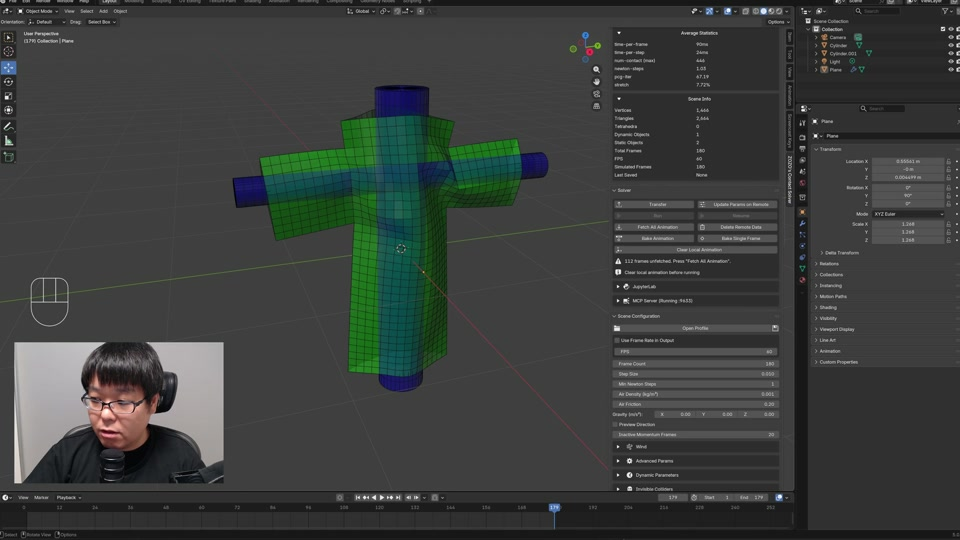](https://zozo.box.com/s/i6kr5jlha7tbrq1452c43t4l6bugmozd){target="_blank" rel="noopener"}

</figure>
<figure>
<figcaption><strong>Twisting a Cylinder</strong>Pin both ends of a cylinder and rotate them to apply a twist.</figcaption>

[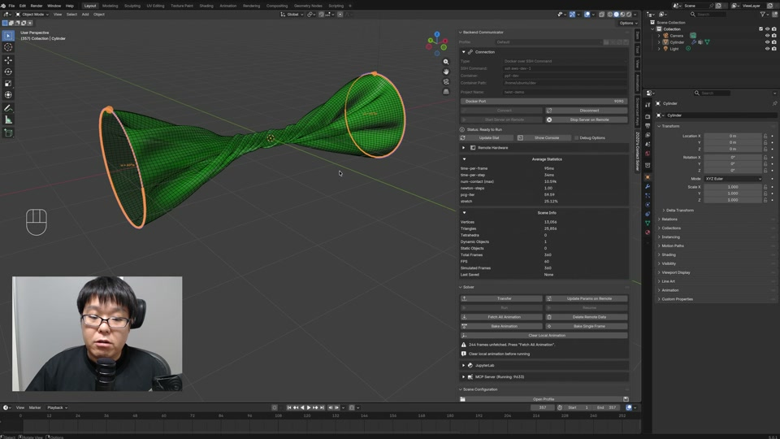](https://zozo.box.com/s/werjjc01v0quqqdpyv5k9yntnx1z6p76){target="_blank" rel="noopener"}

</figure>
<figure>
<figcaption><strong>Compressing Objects</strong>Squeeze a body between colliders so it deforms under load.</figcaption>

[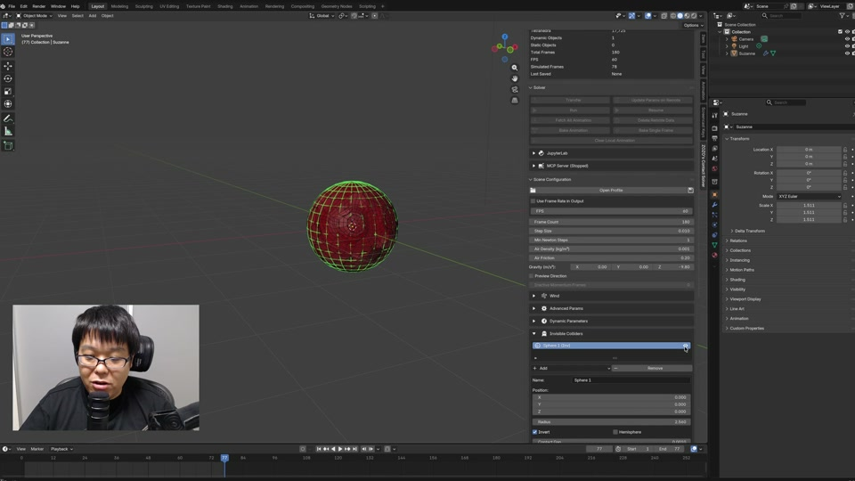](https://zozo.box.com/s/zdg8wvgj6qdwrezxyvph5fq9pn7t10kq){target="_blank" rel="noopener"}

</figure>
<figure>
<figcaption><strong>Curves</strong>Use Blender curve objects as Rod elements.</figcaption>

[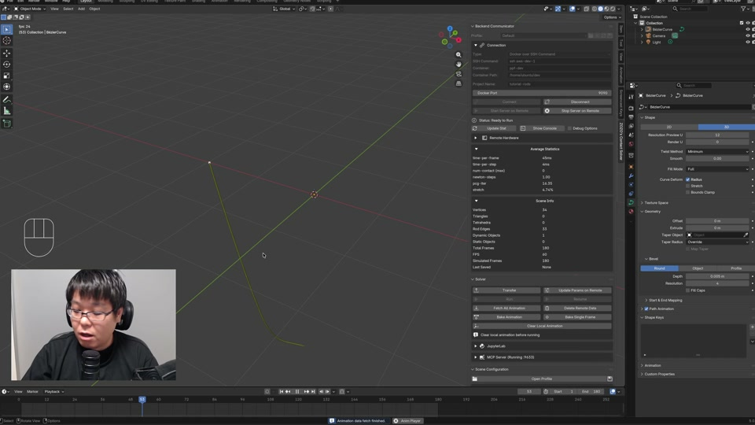](https://zozo.box.com/s/xg0g34tutr0brbjh9ogcrpr2tsn4x8y3){target="_blank" rel="noopener"}

</figure>
<figure>
<figcaption><strong>JupyterLab Integration</strong>Run a JupyterLab session alongside the add-on.</figcaption>

[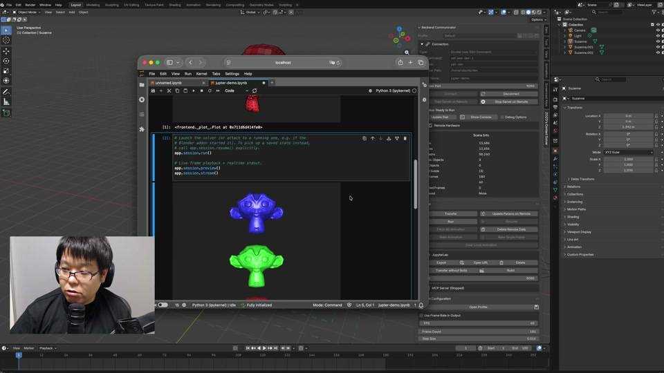](https://zozo.box.com/s/3wekaj81h3hb0uuet49h1cj0swcap6v4){target="_blank" rel="noopener"}

</figure>
<figure>
<figcaption><strong>Simulating Net</strong>Build a net structure and watch it deform under load.</figcaption>

[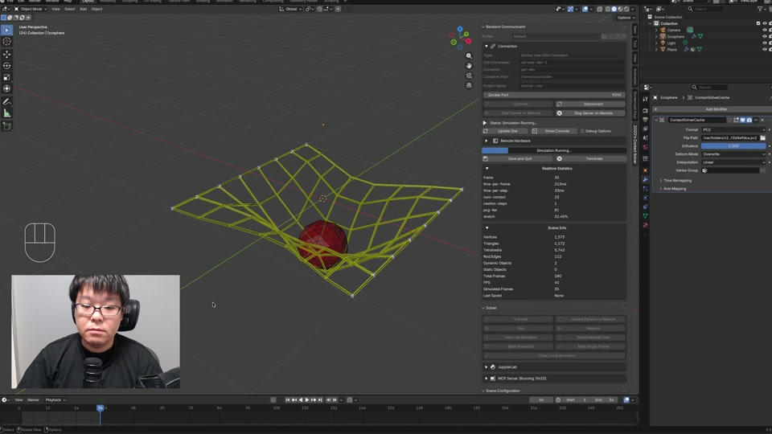](https://zozo.box.com/s/n6zedasjsqyujuhw8sc5ynhmbm274p0u){target="_blank" rel="noopener"}

</figure>
<figure>
<figcaption><strong>Plasticity</strong>Set plasticity parameters for permanent deformation.</figcaption>

[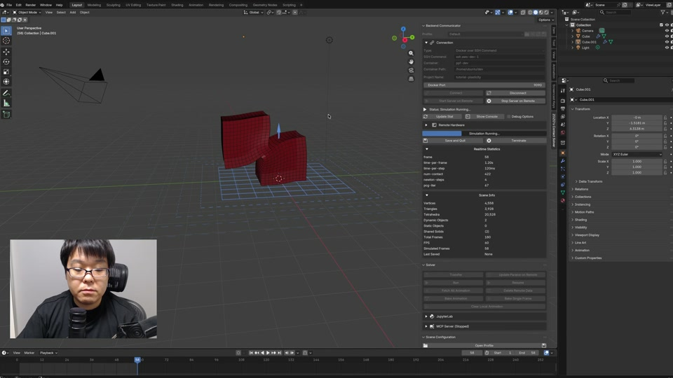](https://zozo.box.com/s/61u6kxm4cagloo48u9bhomceghf6todd){target="_blank" rel="noopener"}

</figure>
<figure>
<figcaption><strong>LLM Integration via MCP</strong>Drive the add-on from an LLM through the MCP server.</figcaption>

[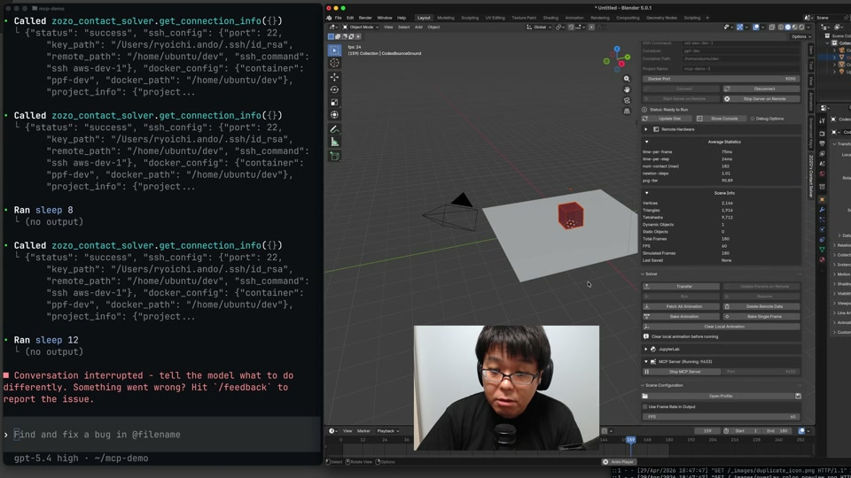](https://zozo.box.com/s/06nzk5aep2onak2sk5tgp2rzj54jhpv6){target="_blank" rel="noopener"}

</figure>
<figure>
<figcaption><strong>Velocity Overwrite</strong>Override simulated velocity with keyframed targets.</figcaption>

[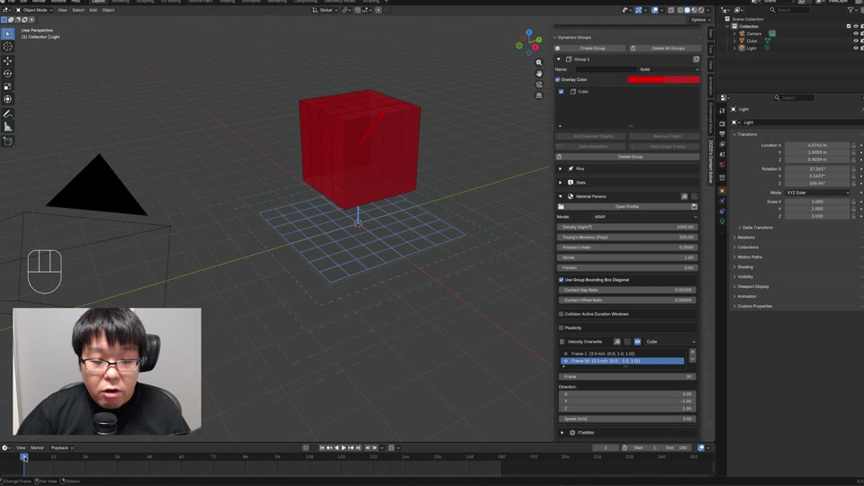](https://zozo.box.com/s/qbzallgux3fprxp5olznvg40tbopxsf4){target="_blank" rel="noopener"}

</figure>
<figure>
<figcaption><strong>Pin Constraints</strong>Fix selected vertices in place so they stay put during simulation.</figcaption>

[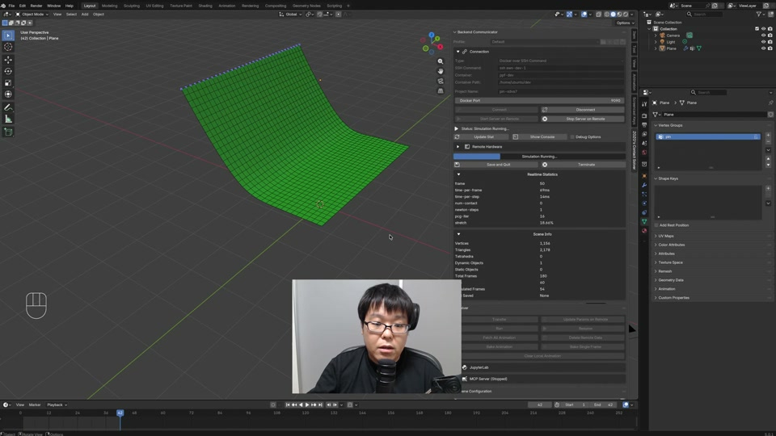](https://zozo.box.com/s/gxcrn4eztj0inovcwv8a7cbv8ik38h2z){target="_blank" rel="noopener"}

</figure>
<figure>
<figcaption><strong>Moving Pins</strong>Drive pinned vertices along an animation so the constraint moves over time.</figcaption>

[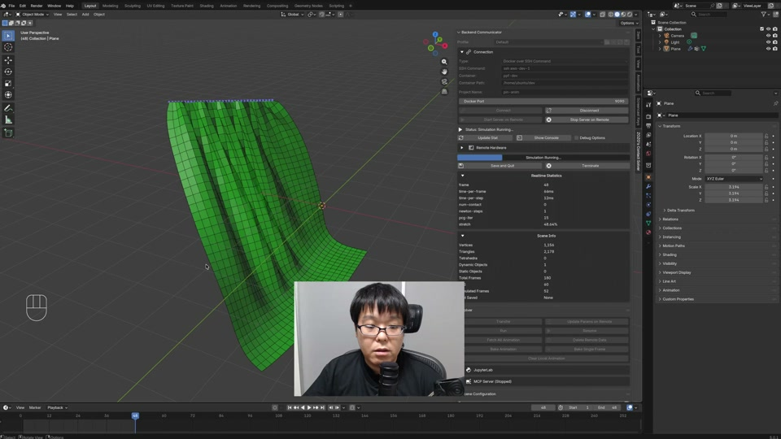](https://zozo.box.com/s/tejmok5l9uf36hwbacwswwfkd3erngxk){target="_blank" rel="noopener"}

</figure>
<figure>
<figcaption><strong>More Pin Operations</strong>Extra controls on top of basic fixed pins.</figcaption>

[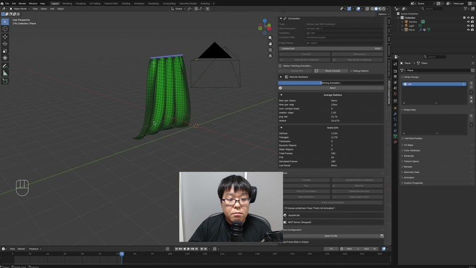](https://zozo.box.com/s/aaxhpc0s7d163gmg8q2r5vbauqi54u23){target="_blank" rel="noopener"}

</figure>
<figure>
<figcaption><strong>Static Colliders</strong>Mark rigid objects as static obstacles for dynamic bodies to collide against.</figcaption>

[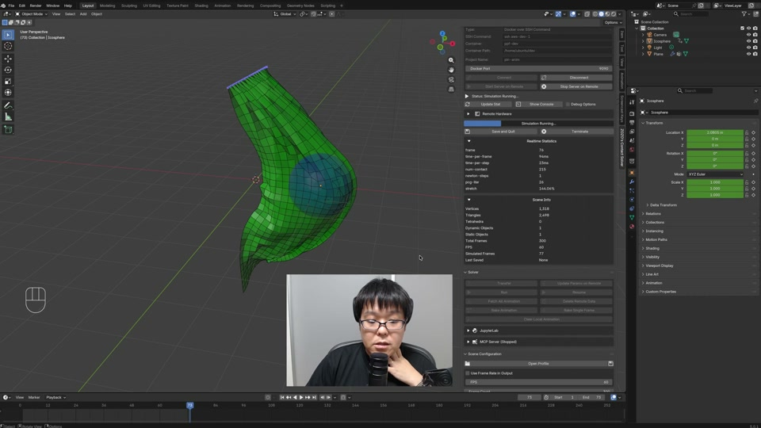](https://zozo.box.com/s/e88aqg4z2bcelqrd3kgghgdwzzrvlv0z){target="_blank" rel="noopener"}

</figure>
<figure>
<figcaption><strong>Inflating Sheets</strong>Apply pressure to a closed shell so it puffs outward.</figcaption>

[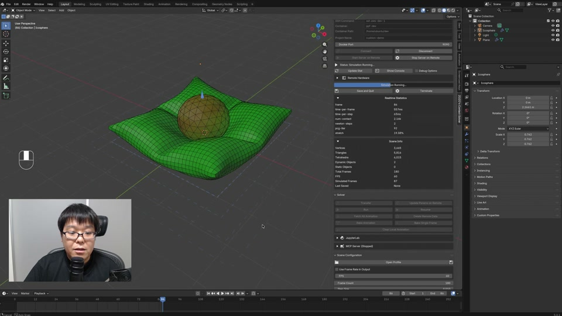](https://zozo.box.com/s/iezn4ifv2jbtmub6wg3ifb3xwk4cj0dn){target="_blank" rel="noopener"}

</figure>
<figure>
<figcaption><strong>Strain Limiting</strong>Cap per-element stretch so cloth and shells don't extend rubber-like.</figcaption>

[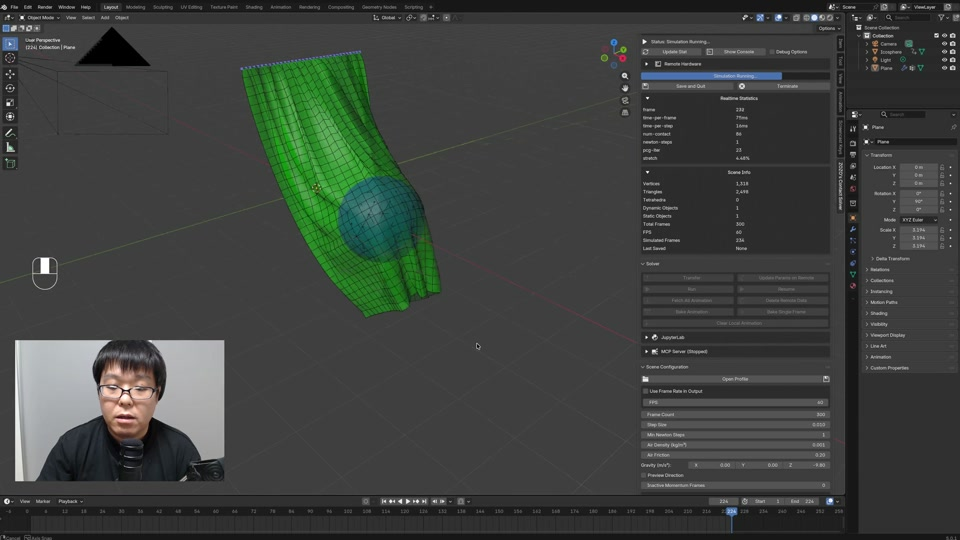](https://zozo.box.com/s/g76l6i8jsim9xx9dem2mru8m5b84gyfb){target="_blank" rel="noopener"}

</figure>
<figure>
<figcaption><strong>Wind Effect</strong>Drive cloth motion with a directional wind force.</figcaption>

[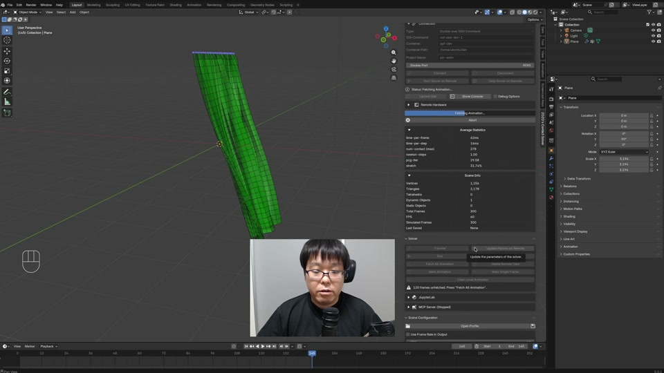](https://zozo.box.com/s/2l66jmdotnoig6ks9405fq6n77gm4kdq){target="_blank" rel="noopener"}

</figure>
<figure>
<figcaption><strong>Snap and Merge</strong>Snap nearby vertices together and merge them into a single mesh.</figcaption>

[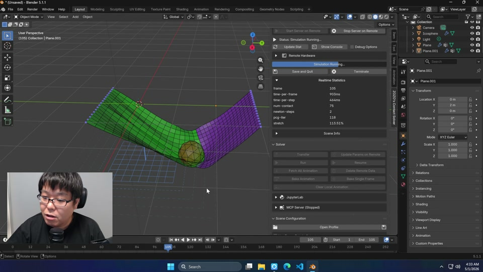](https://zozo.box.com/s/ndqjlf67cdo2dv3xjynqftitg3244a1z){target="_blank" rel="noopener"}

</figure>

